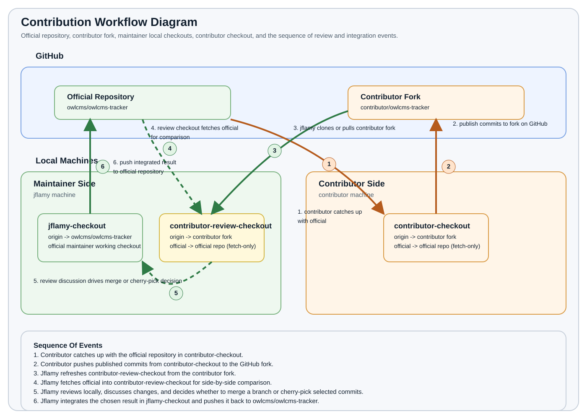

# Contribution Workflow

This document describes the local and GitHub workflow for reviewing changes proposed from a fork back to the original repository `owlcms/owlcms-tracker`.

The intent is simple:

- `contributor` develops in a fork.
- `jflamy` can inspect the proposed changes locally on his own machine.

## Repositories And Local Checkouts



- GitHub original: `owlcms/owlcms-tracker`
- GitHub fork: `contributor/owlcms-tracker`
- Original local checkout: `jflamy-checkout`
- Local checkout on the contributor machine: `contributor-checkout`
- Review checkout for contributor changes on `jflamy`'s machine: `contributor-review-checkout`

## Git Setup

### In `jflamy-checkout`

`jflamy` normally has only the original repository as `origin`:

```bash
git remote -v
```

Expected shape:

```text
origin  https://github.com/owlcms/owlcms-tracker.git (fetch)
origin  https://github.com/owlcms/owlcms-tracker.git (push)
```

### In `contributor-checkout`

`contributor` uses the fork as `origin` and the original repository as a second remote named `official`.

Add the second remote once:

```bash
git remote add official https://github.com/owlcms/owlcms-tracker.git
git remote set-url --push official no_push
```

Expected shape:

```text
origin     https://github.com/contributor/owlcms-tracker.git (fetch)
origin     https://github.com/contributor/owlcms-tracker.git (push)
official   https://github.com/owlcms/owlcms-tracker.git (fetch)
official   no_push (push)
```

This makes `official` fetch-only in practice. The working rule is:

- `contributor` fetches from `official`
- `contributor` pushes to `origin`

## Contributor Workflow

### Keep The Fork Current

In `contributor-checkout`, there are three common ways to keep the fork current from the original repository.

#### Option 1: `git pull`

This is the shortest form. It fetches from `official` and then integrates the changes.

```bash
git switch main
git pull official main
git push origin main
```

Use this when the contributor wants the simplest command sequence and is comfortable with Git deciding the integration step.

#### Option 2: `git fetch` + `git merge`

This makes the fetch step explicit and then merges the original repository branch into the fork branch.

```bash
git fetch official
git switch main
git merge official/main
git push origin main
```

Use this when the contributor wants a clear, explicit merge-based history.

#### Option 3: `git fetch` + `git rebase`

This also makes the fetch step explicit, but rewrites the local fork branch on top of the original repository branch.

```bash
git fetch official
git switch main
git rebase official/main
git push origin main
```

Use this when the contributor prefers a linear history.

### Publish The Change

This workflow does not assume a separate feature branch. The contributor can publish his changes to `main` or to any branch on the fork.

Make changes, commit them, and push them to the fork branch being used for publication:

```bash
git push -u origin <published-branch>
```

At this point the proposed work exists on GitHub in `contributor/owlcms-tracker`, on whatever branch the contributor chose to publish.

## Jflamy Review Workflow

`jflamy` uses a second local checkout for review instead of fetching the contributor fork into `jflamy-checkout`.

### Create The Review Checkout

On `jflamy`'s machine, clone the contributor fork into a separate review checkout:

```bash
git clone https://github.com/contributor/owlcms-tracker.git contributor-review-checkout
```

Then configure the original repository as a fetch-only remote:

```bash
cd contributor-review-checkout
git remote add official https://github.com/owlcms/owlcms-tracker.git
git remote set-url --push official no_push
git fetch official
```

If the contributor published to a branch other than the default branch of the fork, `jflamy` can switch to it in this second checkout before reviewing.

### Compare The Proposed Change

Compare the currently checked out state of the contributor fork with the original main branch:

```bash
git diff official/main..HEAD
git log --oneline --graph --decorate official/main..HEAD
```

This is usually enough to inspect the scope and shape of the proposed work.

### Review Locally

Now `contributor-review-checkout` contains the contributor's proposed state, while `jflamy-checkout` remains untouched on the original repository.

`jflamy` can then:

- run the application locally
- inspect files and diffs in VS Code
- test behavior
- discuss the proposal

### Refresh The Review Checkout Later

To refresh the second checkout after the contributor pushes more changes:

```bash
git pull origin
git fetch official
```

## Summary

The working model is:

- `owlcms/owlcms-tracker` is the original repository
- `contributor/owlcms-tracker` is the fork
- `contributor` works in `contributor-checkout`
- `contributor-checkout` uses:
  - `origin` -> `contributor/owlcms-tracker`
  - `official` -> `owlcms/owlcms-tracker`
- `contributor` syncs from `official` and pushes to `origin`
- `jflamy` keeps `jflamy-checkout` for the original repository
- `jflamy` uses `contributor-review-checkout` as a second local checkout of the fork for review

This keeps the workflow simple and avoids the need for worktrees while preserving a clean original checkout on `jflamy`'s machine.

## ANNEX: updating the official version

### Primitive: Maintainer manual merge

After reviewing the change, jflamy copies files from his checkout of the contributor

## Better: Git-assisted Maintainer Integration From The Contributor Fork

If `jflamy`, as keeper of the official repository, decides that the contributor's work should be integrated, there are two common options:

1. cherry-pick specific commits from the contributor fork
2. merge a contributor branch as a whole

These operations happen in `jflamy-checkout`, not in `contributor-review-checkout`.

### Prepare `jflamy-checkout`

Add the contributor fork as a remote if it is not already configured:

```bash
git remote add contributor https://github.com/contributor/owlcms-tracker.git
git fetch contributor
```

If the remote already exists, a refresh is enough:

```bash
git fetch contributor
```

### Option 1: Cherry-Pick Specific Commits

This is useful when only some contributor commits should be integrated.

Inspect the available commits first:

```bash
git log --oneline contributor/<published-branch>
```

Switch to the target branch in the official checkout, usually `main`:

```bash
git switch main
git pull origin main
```

Then cherry-pick the desired commits:

```bash
git cherry-pick <commit-sha1> <commit-sha2>
```

If conflicts occur, resolve them, then continue:

```bash
git add <resolved-files>
git cherry-pick --continue
```

If the cherry-pick should be abandoned:

```bash
git cherry-pick --abort
```

When the result is correct, push to the official repository:

```bash
git push origin main
```

### Option 2: Merge A Contributor Branch

This is useful when the contributor branch is already clean and should be taken as a whole.

Switch to the target branch in the official checkout:

```bash
git switch main
git pull origin main
```

Then merge the contributor branch:

```bash
git merge contributor/<published-branch>
```

If `jflamy` wants an explicit merge commit even when Git could fast-forward:

```bash
git merge --no-ff contributor/<published-branch>
```

If conflicts occur, resolve them, then complete the merge:

```bash
git add <resolved-files>
git commit
```

If the merge should be abandoned:

```bash
git merge --abort
```

When the result is correct, push to the official repository:

```bash
git push origin main
```

### Advanced: Contributor Prepares A Branch For A Pull Request Or Maintainer Merge

After review and discussion, the contributor may decide that only some of the changed files should go into the final proposed integration.

The goal is to prepare a clean branch that can be used in either of these ways:

1. as the source branch for a pull request
2. as the contributor branch that `jflamy` later merges or cherry-picks from

The cleanest approach is:

1. Keep the broader work in the contributor fork.
2. Create a new clean branch starting from the current official baseline.
3. Copy only the selected files into that new branch.
4. Commit and push that focused branch.

#### Recommended File-Level Workflow

Start from the contributor checkout:

```bash
git fetch official
git switch -c pr-subset official/main
```

Then copy only the files that should be part of the proposed integration from the contributor's fork `main`.

For example, if the the two files to be included are:

```bash
git checkout main -- path/to/file1 path/to/file2
```

If the source branch is some other contributor branch:

```bash
git checkout <source-branch> -- path/to/file1 path/to/file2
```

Review the result:

```bash
git status
git diff
```

Then commit the targeted files and push the focused branch:

```bash
git add path/to/file1 path/to/file2
git commit -m "Describe the focused change"
git push -u origin pr-subset
```

At that point the contributor has a clean published branch, `contributor/pr-subset`, that can be used either for a pull request to `owlcms/main` or for a maintainer-side merge or cherry-pick.

#### Why This Is Safer

This approach avoids using a branch that contains unrelated work. It also gives `jflamy` a smaller and easier-to-review change set, whether the final integration happens through a pull request, a merge, or cherry-picking.

#### Practical Rule

If the contributor has a large mixed set of changes, do not trim the existing branch in place unless there is a good reason. Instead, create a fresh branch from `official/main` and bring over only the files intended for the final reviewed integration.


