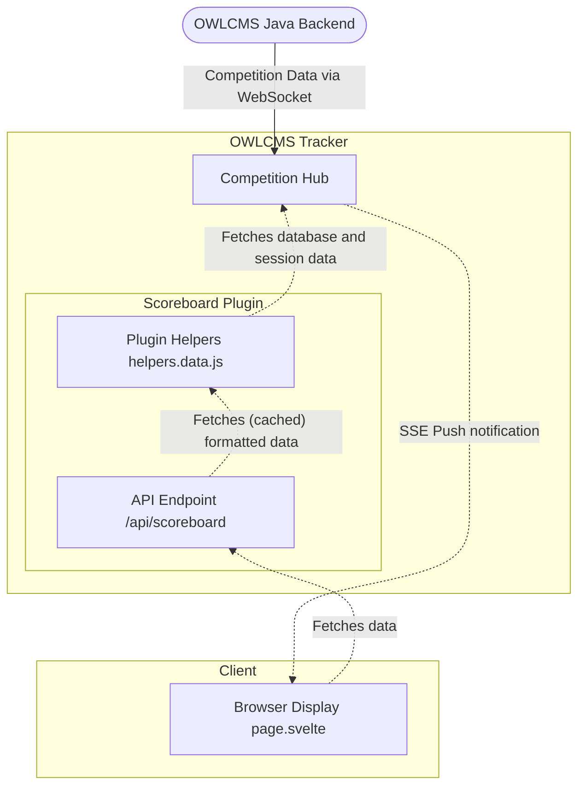

<!-- markdownlint-disable -->
# Scoreboard Architecture - Multi-FOP, Multi-Scoreboard System

## System Architecture Overview



## Overview

This system targts **15+ different scoreboard types** with **up to 6 simultaneous FOPs** for each scoreboard type. 

**OWLCMS Integration:**
- OWLCMS sends data via WebSocket connection to `ws://localhost:8096/ws`
- **No changes needed to OWLCMS** - just configure the WebSocket URL once
- Competition Hub stores per-FOP data from WebSocket messages
- Scoreboards pull processed data via `/api/scoreboard?type=...&fop=...`

> **Terminology update:** The OWLCMS update payload now exposes the ordered session list as `startOrderAthletes` (formerly `groupAthletes`). Existing references to `groupAthletes` in this document describe the same structure.

**Key Design Principles:**
1. **Modular** - Each scoreboard type is self-contained in its folder
2. **Server-side processing** - Process data once, serve hundreds of browsers
3. **Plugin-level caching** - Each scoreboard caches processed results
4. **URL-based configuration** - FOP selection and options via query parameters
5. **AI-assisted development** - Easy for novices to create/modify scoreboards
6. **No OWLCMS changes required** - Works with existing data flow
7. **Session Athletes First, Always** - Use `groupAthletes` from WebSocket type="update" as primary data source; only access `databaseState` for athletes NOT in current session

## Data Source Priority

**Key principle:** Always use session athletes data first (from WebSocket type="update", stored in the `groupAthletes` key). Only access Database Athletes (from WebSocket type="database") for athletes NOT in the current session (e.g., athletes from previous sessions, different teams).

For detailed implementation and data flow information, see **[OWLCMS_TRANSLATIONS_SPEC.md](./OWLCMS_TRANSLATIONS_SPEC.md)**.

## Architecture

### High-Level Data Flow with Caching

```
OWLCMS → WebSocket (ws://localhost:8096/ws)
      → type="database" (full competition data - athletes, categories, FOPs)
      → type="update" (lifting order changes, athlete switches)
         ↓
    Competition Hub (stores raw per-FOP data)
         ↓
         ↓ Broadcasts SSE on state changes
         ↓
Browser 1: Receives SSE → Fetches /api/scoreboard?type=team-scoreboard&fop=A
           ↓
    Plugin helpers.data.js (cache miss)
           ↓ Compute team grouping, sorting, filtering (50ms)
           ↓ Store in plugin cache
           ↓
    Return processed data to Browser 1
    
Browser 2-200: Receive same SSE → Fetch same /api/scoreboard URL
           ↓
    Plugin helpers.data.js (cache hit!)
           ↓ Return cached data (1ms each)
           ↓
    Return processed data to Browsers 2-200

Timer Event: OWLCMS → WebSocket type="timer" (StartTime)
           ↓
    Competition Hub updates timer state
           ↓ Broadcasts SSE
           ↓
    All browsers fetch /api/scoreboard
           ↓
    Plugin cache HIT (data hash unchanged)
           ↓ Return cached data + updated timer state
           ↓
    Browsers update timer display only (no recomputation)
```

**Benefits:**
- ✅ **Performance improvement** - Cache eliminates redundant processing
- ✅ **Timer efficiency** - Timer events don't trigger recomputation
- ✅ **Plugin-specific rules** - Each scoreboard implements custom caching
- ✅ **Scalable to hundreds of browsers** - First browser computes, rest hit cache

### Competition Hub State Stores

The hub keeps two long-lived caches so every scoreboard request can be served without re-reading the raw WebSocket payloads:

- `databaseState` – the full competition database supplied by OWLCMS `type="database"` messages. It holds every athlete, team, category, translation checksum, etc. `competition-hub.js` refreshes this structure whenever a new database payload arrives and also patches it with the latest `sessionAthletes` payload so long-running scoreboards see fresh attempt data even between full dumps. 
- `fopUpdates` – a per-FOP map keyed by `fopName`. Each entry merges the latest `update`, `timer`, and `decision` payloads for that platform, so downstream helpers can grab the most recent lifting order, timer state, and decision lights in one read.  When an update is received, data about the `sessionAthletes` is received.  This is the database athlete info plus additional precomputed information to make display easier (which athlete is current, etc.). `startOrderAthletes` and `liftingOrderAthletes` lists are lightweight arrays of IDs (plus spacer rows) that point back to session athlete objects; they do not carry independent copies of athlete data.

### Update Event Flow (Standard Path)

1. **OWLCMS sends type="update" message** (LiftingOrderUpdated, SwitchGroup, etc.)
   - Contains precomputed data: `liftingOrderAthletes`, `groupAthletes`
   - Current athlete info: `fullName`, `teamName`, `weight`, `attempt`, etc.
   - FOP identifier: `fopName`

2. **Competition Hub processes update**
   - Merges new data with existing FOP state
   - Preserves data from previous updates (e.g., timer state during athlete changes)
   - Stores in `fopUpdates[fopName]`
  - Applies fresh session athlete info back into `databaseState` so the full competition dataset stays current between `/database` dumps

3. **Hub broadcasts SSE message**
   - Simple notification: "FOP Platform_A has new data"
   - No payload - just a trigger

4. **All connected browsers receive SSE**
   - Triggers API fetch: `/api/scoreboard?type=lifting-order&fop=Platform_A`
   - Receives complete processed data for display

5. **Scoreboard updates immediately**
   - New lifting order rendered
   - Current athlete highlighted
   - Attempt numbers updated

**Benefits:**
- ✅ **OWLCMS does all business logic** (rankings, sinclair, totals)
- ✅ **Hub processes once** → Hundreds of browsers fetch same result
- ✅ **SSE is lightweight** → Only triggers, no large payloads
- ✅ **Browsers always get fresh data** → No stale cache issues

### Timer Event Flow (Efficient Caching)

Timer events are **optimized for cache efficiency** because they don't change athlete data.

1. **OWLCMS sends type="timer" message** (StartTime, StopTime, SetTime)
   - `athleteTimerEventType`: "StartTime", "StopTime", or "SetTime"
   - `athleteMillisRemaining`: Time remaining in milliseconds
   - `timeAllowed`: Total time allowed (usually 60000ms)
   - `fopName`: FOP identifier

2. **Competition Hub processes timer event**
   - Updates timer state in `fopUpdates[fopName]`
   - **Important:** Does NOT change `groupAthletes` or `liftingOrderAthletes`
   - Broadcasts SSE message: "FOP Platform_A has new data"

3. **All connected browsers receive SSE**
   - Triggers API fetch: `/api/scoreboard?type=lifting-order&fop=Platform_A`
   - **First browser:** Checks cache using data hash
     - Data hash based on `groupAthletes` JSON (first 100 chars)
     - Hash is **unchanged** because athletes didn't change
     - **Cache HIT** - Returns cached processed data
     - Updates timer state from current `fopUpdate`
     - Processing time: ~1ms (no recomputation)
   - **Remaining 199 browsers:** Same cache hit
     - All fetch same processed data from cache
     - Total processing: 200 × 1ms = 200ms

4. **Browsers update display**
   - Receive processed data with updated timer state
   - Client-side countdown begins (autonomous)
   - No further server communication for 60 seconds
   - Timer ticks locally using `Date.now() - startTime`

**Cache Behavior:**

```javascript
// Plugin cache key does NOT include timer state
const dataHash = fopUpdate?.groupAthletes?.substring(0, 100) || '';
const cacheKey = `${fopName}-${dataHash}-${gender}-${topN}`;
// Timer state changes → Same cache key → Cache HIT ✅

// Extract timer separately (changes frequently)
function extractTimerState(fopUpdate) {
  return {
    state: fopUpdate?.athleteTimerEventType === 'StartTime' ? 'running' : 'stopped',
    timeRemaining: parseInt(fopUpdate?.athleteMillisRemaining || 0),
    duration: parseInt(fopUpdate?.timeAllowed || 60000)
  };
}

// Return cached data + fresh timer state
return {
  ...cachedProcessedData,  // From cache (team groupings, sorting, etc.)
  timer: extractTimerState(fopUpdate)  // Fresh from current update
};
```

**Performance Impact:**

| Event Type | First Browser | Next 199 Browsers | Cache Behavior |
|------------|---------------|-------------------|----------------|
| **Timer StartTime** | 1ms (cache hit) | 1ms each | No recomputation - athletes unchanged |
| **Athlete lifts** | 50ms (cache miss) | 1ms each | Recomputes once - new `groupAthletes` |
| **Weight change** | 50ms (cache miss) | 1ms each | Recomputes once - new `liftingOrderAthletes` |

**Benefits:**
- ✅ **Zero recomputation on timer events** - Cache stays valid
- ✅ **Scalable to hundreds of browsers** - All hit same cache
- ✅ **Client-side countdown** - No server load during 60-second timer
- ✅ **Fresh timer state** - Extracted separately from cached data
- ✅ **40× faster** than recomputing for every browser

**See also:** [Implementation Details → Timer Event Flow](#timer-event-flow-client-side-countdown) for client-side countdown implementation.

### Decision Event Flow (Not Yet Implemented)

Decision events follow the **same efficient caching pattern as timer events** because the decision itself doesn't change athlete data immediately.

**Two-Phase Processing:**

**Phase 1: Decision Event (Immediate Display)**

1. **OWLCMS sends type="decision" message** (referee decisions)
   - `decisionEventType`: Decision type (e.g., "GOOD_LIFT", "NO_LIFT")
   - `fopName`: FOP identifier
   - Decision details (referee votes, timestamp)
   - **Does NOT include** updated lifting order or rankings

2. **Competition Hub processes decision event**
   - Updates decision state in `fopUpdates[fopName]`
   - **Important:** Does NOT change `groupAthletes` or `liftingOrderAthletes` yet
   - Broadcasts SSE message: "FOP Platform_A has new data"

3. **All connected browsers receive SSE**
   - Triggers API fetch: `/api/scoreboard?type=lifting-order&fop=Platform_A`
   - **Cache HIT** - Athletes unchanged, returns cached processed data
   - Decision state extracted separately from current `fopUpdate`
   - Processing time: ~1ms per browser (no recomputation)

4. **Browsers display decision immediately**
   - Show decision lights/indicators
   - Visual feedback to audience
   - Athlete data remains unchanged (for now)

**Phase 2: Update Event (Recomputed Rankings)**

5. **OWLCMS recomputes** lifting order and rankings based on decision
   - Generates new `groupAthletes` with updated totals
   - Generates new `liftingOrderAthletes` with new order
   - Sends type="update" message (follows Standard Path)

6. **Competition Hub processes type="update" message**
   - New `groupAthletes` JSON → New data hash
   - **Cache MISS** - Data changed, must recompute

7. **Browsers fetch updated data**
   - First browser computes new team groupings, sorting (50ms)
   - Remaining browsers hit fresh cache (1ms each)
   - Display updated lifting order, totals, ranks

**Cache Behavior:**

```javascript
// Decision state extracted separately (like timer)
function extractDecisionState(fopUpdate) {
  return {
    type: fopUpdate?.decisionEventType || null,
    timestamp: fopUpdate?.decisionTimestamp || null,
    refereeDecisions: fopUpdate?.refereeDecisions || [],
    display: fopUpdate?.decisionEventType ? 'show' : 'hide'
  };
}

// Phase 1: Decision event → Cache HIT
const dataHash = fopUpdate?.groupAthletes?.substring(0, 100) || '';
const cacheKey = `${fopName}-${dataHash}-${options}`;
// Decision state changes, athletes unchanged → Same hash → Cache HIT ✅

return {
  ...cachedProcessedData,  // From cache (unchanged athletes)
  decision: extractDecisionState(fopUpdate),  // Fresh decision
  timer: extractTimerState(fopUpdate)  // Fresh timer
};

// Phase 2: Update event → Cache MISS
// New groupAthletes → New hash → Cache MISS → Recompute ✅
```

**Timeline Example:**

```
T=0s:   OWLCMS sends DECISION (GOOD_LIFT)
        → Hub broadcasts SSE
        → 200 browsers fetch /api/scoreboard
        → All hit cache (1ms each, 200ms total)
        → Display decision lights immediately

T=1s:   OWLCMS recomputes rankings
        → Sends UPDATE with new groupAthletes
        → Hub broadcasts SSE
        → First browser recomputes (50ms)
        → Remaining 199 browsers hit fresh cache (199ms)
        → Display updated lifting order, totals
```

**Benefits:**
- ✅ **Instant decision feedback** - Cache hit for immediate display
- ✅ **Deferred ranking update** - Only recomputtes when OWLCMS sends new data
- ✅ **Two-phase processing** - Visual feedback first, data update second
- ✅ **Scalable** - Same cache efficiency as timer events
- ✅ **No redundant computation** - Decision doesn't trigger unnecessary work

**Implementation Status:** 🚧 Not yet implemented - design documented for future development.

## Directory Structure

```
src/
├── lib/server/
│   ├── competition-hub.js          # Stores per-FOP data from OWLCMS
│   └── scoreboard-registry.js      # Auto-discovers scoreboard plugins
├── routes/
│   ├── [scoreboard]/
│   │   ├── +page.server.js         # Dynamic route handler
│   │   └── +page.svelte            # Generic scoreboard wrapper
│   └── api/scoreboard/
│       └── +server.js              # Unified API endpoint
└── plugins/
    ├── lifting-order/   # Scoreboard type 1
    │   ├── config.js               # Metadata, options
    │   ├── helpers.data.js         # Server-side data processing
    │   ├── page.svelte             # Display component
    │   └── README.md               # AI prompts
    ├── results/         # Scoreboard type 2
    │   └── ...
    └── team-rankings/   # Scoreboard type 3
        └── ...
```

## Plugin-Hub Interaction Pattern

This section explains how **plugin-specific helpers** (the "plugin layer") interact with the **shared competition hub** (the "central data layer") to deliver scoreboard data to browsers.

### Data Flow: Browser → Route → Helper → Hub → Browser

```
Browser Request
  ↓
GET /api/scoreboard?type=team-scoreboard&fop=Platform_A&sortBy=sinclair&topN=15
  ↓
routes/api/scoreboard/+server.js (unified API endpoint)
  ↓ (reads request parameters)
  ↓
Loads plugin: src/plugins/team-scoreboard/helpers.data.js
  ↓
getScoreboardData(fopName='Platform_A', options={sortBy:'sinclair', topN:15})
  ↓
Helper function executes:
  ├─ Import shared hub: `import { competitionHub } from '$lib/server/competition-hub.js'`
  ├─ Fetch per-FOP data: `const fopUpdate = competitionHub.getFopUpdate(fopName)`
  ├─ Parse JSON strings: `const athletes = JSON.parse(fopUpdate.groupAthletes)`
  ├─ Apply plugin logic: Group by team, sort, compute totals
  ├─ Check/update cache: Store processed result with data hash
  └─ Return processed object: { athletes, teams, totals, ... }
  ↓
API endpoint returns JSON response
  ↓
Browser receives data
  ↓
Svelte component (page.svelte) displays data (pure rendering, no logic)
```

### Plugin Module Structure

Each scoreboard plugin is a **self-contained folder** with **three key files**:

#### 1. **config.js** - Metadata and Options

Defines the scoreboard's identity and user-configurable options.

```javascript
// src/plugins/team-scoreboard/config.js

export default {
  name: 'Team Scoreboard',
  description: 'Shows team rankings with athlete grouping',
  options: [
    {
      key: 'sortBy',
      label: 'Sort By',
      type: 'select',
      options: ['total', 'sinclair'],
      default: 'total'
    },
    {
      key: 'topN',
      label: 'Show Top Teams',
      type: 'number',
      default: 10,
      min: 3,
      max: 50
    }
  ]
};
```

**The API uses this to:**
- Validate user-provided options
- Show available options in discovery endpoints (`POST /api/scoreboard` with `action: "list_scoreboards"`)
- Pass options to helpers.data.js

#### 2. **helpers.data.js** - Plugin-Specific Data Processing

The **plugin-specific business logic** that accesses the shared hub and transforms data.

```javascript
// src/plugins/team-scoreboard/helpers.data.js

import { competitionHub } from '$lib/server/competition-hub.js';

/**
 * Plugin-specific cache stores processed results
 * Key: "fopName-dataHash-option1-option2"
 */
const teamScoreboardCache = new Map();

export function getScoreboardData(fopName = 'A', options = {}, locale = 'en') {
  // 1. ACCESS SHARED HUB
  const fopUpdate = competitionHub.getFopUpdate(fopName);
  const databaseState = competitionHub.getDatabaseState();
  const translations = competitionHub.getTranslations(locale);
  
  // 2. EXTRACT OPTIONS
  const sortBy = options.sortBy || 'total';
  const topN = options.topN || 10;
  
  // 3. BUILD CACHE KEY (based on hub FOP version, which increments on data changes)
  // The hub version is incremented whenever relevant messages arrive (update/timer/decision/database)
  // This avoids content-based hashing - simpler and more efficient
  const hubFopVersion = competitionHub.getFopStateVersion(fopName);
  const cacheKey = `${fopName}-v${hubFopVersion}-${sortBy}-${topN}`;
  
  // 4. CHECK PLUGIN-SPECIFIC CACHE
  if (teamScoreboardCache.has(cacheKey)) {
    const cached = teamScoreboardCache.get(cacheKey);
    console.log(`[Team Scoreboard] ✓ Cache hit`);
    
    // Return cached processed data + fresh timer/decision state
    return {
      ...cached,
      timer: extractTimerState(fopUpdate),
      decision: extractDecisionState(fopUpdate)
    };
  }
  
  console.log(`[Team Scoreboard] Cache miss, computing...`);
  
  // 5. FETCH DATA FROM HUB
  // Session athletes (primary source - from WebSocket type="update")
  // These have displayInfo ALREADY computed by OWLCMS
  let sessionAthletes = [];
  if (fopUpdate?.groupAthletes) {
    sessionAthletes = JSON.parse(fopUpdate.groupAthletes); // Parse JSON string
    // Each sessionAthletes[i] already has displayInfo with:
    // - fullName, teamName, weight, total, sinclair, rank
    // - classname: "current-athlete", "waiting", "good-lift", "no-lift", "finished"
    // - displayWeight, displayAttempt (formatted strings)
    // All precomputed by OWLCMS - use directly!
  }
  
  // If you need athletes NOT in current session (e.g., from other teams/sessions),
  // merge them from databaseState and compute displayInfo yourself
  let allTeamAthletes = [...sessionAthletes];
  const sessionIds = new Set(sessionAthletes.map(a => a.id));
  
  // Example: Add athletes from specific team(s) not in current session
  const databaseState = competitionHub.getDatabaseState();
  if (databaseState?.athletes && options.includeAllTeamMembers) {
    databaseState.athletes.forEach(dbAthlete => {
      if (!sessionIds.has(dbAthlete.id) && dbAthlete.teamName === options.filterTeam) {
        // Compute displayInfo from database fields
        const displayInfo = {
          fullName: dbAthlete.fullName,
          teamName: dbAthlete.teamName,
          weight: dbAthlete.weight || 0,
          total: dbAthlete.total || 0,
          sinclair: dbAthlete.sinclair || 0,
          rank: dbAthlete.rank || 0,
          // Format display values
          displayWeight: String(dbAthlete.weight || 0),
          displayAttempt: '0/3',  // Not lifting in this session
          classname: '', // Not currently lifting
          bestSnatch: dbAthlete.snatch || 0,
          bestCleanJerk: dbAthlete.cleanAndJerk || 0
        };
        
        allTeamAthletes.push({
          id: dbAthlete.id,
          startNumber: dbAthlete.startNumber,
          ...displayInfo
        });
      }
    });
  }
  
  // 6. APPLY PLUGIN BUSINESS LOGIC
  // Group athletes by team (now includes both session + database athletes)
  const teamMap = new Map();
  allTeamAthletes.forEach(athlete => {
    const team = athlete.teamName || 'No Team';
    if (!teamMap.has(team)) {
      teamMap.set(team, []);
    }
    teamMap.get(team).push(athlete);
  });
  
  // Convert to array and compute team totals
  const teams = Array.from(teamMap, ([teamName, members]) => ({
    teamName,
    members,
    totalScore: members.reduce((sum, a) => sum + (a.total || 0), 0)
  }));
  
  // Sort teams
  teams.sort((a, b) => b.totalScore - a.totalScore);
  
  // Limit to top N
  const topTeams = teams.slice(0, topN);
  
  // 7. BUILD PROCESSED RESULT
  const processedData = {
    competition: {
      name: fopUpdate?.competitionName || 'Competition',
      fop: fopName
    },
    teams: topTeams,
    totalTeams: teams.length,
    status: teams.length > 0 ? 'ready' : 'waiting',
    // Pass translated labels to component
    labels: {
      title: translations['Team Scoreboard'] || 'Team Scoreboard',
      fop: translations['FOP'] || 'FOP',
      rank: translations['Rank'] || 'Rank',
      team: translations['Team'] || 'Team',
      athletes: translations['Athletes'] || 'Athletes',
      score: translations['Score'] || 'Score',
      total: translations['Total'] || 'Total'
    }
  };
  
  // 8. CACHE THE RESULT (exclude timer/decision - they change frequently)
  teamScoreboardCache.set(cacheKey, processedData);
  
  // Cleanup: Keep last 20 cache entries
  if (teamScoreboardCache.size > 20) {
    const firstKey = teamScoreboardCache.keys().next().value;
    teamScoreboardCache.delete(firstKey);
  }
  
  // 9. RETURN WITH FRESH TIMER/DECISION STATE
  return {
    ...processedData,
    timer: extractTimerState(fopUpdate),
    decision: extractDecisionState(fopUpdate)
  };
}

// Extract timer state separately (changes frequently)
function extractTimerState(fopUpdate) {
  return {
    state: fopUpdate?.athleteTimerEventType === 'StartTime' ? 'running' : 'stopped',
    timeRemaining: parseInt(fopUpdate?.athleteMillisRemaining || 0),
    duration: parseInt(fopUpdate?.timeAllowed || 60000)
  };
}

// Extract decision state separately (changes frequently)
function extractDecisionState(fopUpdate) {
  return {
    type: fopUpdate?.decisionEventType || null,
    visible: fopUpdate?.decisionsVisible === 'true'
  };
}
```

**Key Pattern:**
- **Import hub once at top** - `import { competitionHub } from '$lib/server/competition-hub.js'`
- **Call hub methods** - `getFopUpdate()`, `getDatabaseState()`, etc.
- **Parse JSON strings** - OWLCMS sends `groupAthletes` and `liftingOrderAthletes` as JSON strings
- **Implement plugin-specific cache** - Based on data hash, not timestamp
- **Extract frequently-changing state separately** - Timer and decision state updated at call time, not cached
- **Return complete object** - Merge cached data with fresh state

#### 3. **page.svelte** - Display-Only Component

The Svelte component receives **pre-processed data** and displays it (no data transformation).

```svelte
<!-- src/plugins/team-scoreboard/page.svelte -->

<script>
  export let data = {};
</script>

<div class="team-scoreboard">
  <h1>{data.labels?.title}</h1>
  <p>{data.labels?.fop}: {data.competition?.fop}</p>
  
  {#each data.teams || [] as team, index}
    <div class="team-card">
      <h2 class="rank-{index + 1}">
        #{index + 1} {team.teamName}
      </h2>
      <div class="team-total">
        {data.labels?.total}: {team.totalScore}
      </div>
      
      <div class="athletes-list">
        <div class="list-header">
          <span>{data.labels?.athletes}</span>
          <span>{data.labels?.score}</span>
        </div>
        {#each team.members as athlete}
          <div class="athlete-row">
            <span>{athlete.fullName}</span>
            <span>{athlete.total || '--'}</span>
          </div>
        {/each}
      </div>
    </div>
  {/each}
  
  {#if data.status === 'waiting'}
    <p class="waiting">Waiting for competition data...</p>
  {/if}
</div>

<style>
  /* Pure styling - no conditional logic, no calculations */
  .team-scoreboard { padding: 2rem; background: #1a1a1a; color: white; }
  .team-card { margin: 1rem; padding: 1rem; border: 1px solid #444; }
  .rank-1 { color: gold; }
  .rank-2 { color: silver; }
  .rank-3 { color: #cd7f32; }
  .athletes-list { margin-top: 1rem; }
  .list-header { display: flex; gap: 1rem; font-weight: bold; padding: 0.5rem 0; border-bottom: 1px solid #666; }
  .athlete-row { display: flex; gap: 1rem; padding: 0.5rem 0; }
</style>
```

**CRITICAL RULE:**
- ✅ Display pre-computed data (`data.teams`, `data.totalScore`)
- ✅ Apply CSS styles
- ❌ NO data transformations (`sort()`, `filter()`, `map()` for computation)
- ❌ NO calculations or business logic
- ❌ NO conditional JSON parsing

### Hub Access Pattern

All plugins follow the same **hub access pattern**:

```javascript
// Step 1: Import the shared hub
import { competitionHub } from '$lib/server/competition-hub.js';

// Step 2: Get per-FOP data
const fopUpdate = competitionHub.getFopUpdate(fopName);

// Step 3: Get database state (only if needed for non-session athletes)
const databaseState = competitionHub.getDatabaseState();

// Step 4: Access specific fields
const athletes = JSON.parse(fopUpdate.groupAthletes);        // Session athletes
const liftingOrder = JSON.parse(fopUpdate.liftingOrderAthletes); // Lifting order
const timerState = fopUpdate.athleteTimerEventType;          // Timer
const decisionState = fopUpdate.decisionEventType;           // Decision
const competitionName = fopUpdate.competitionName;           // Meta
```

**Available Hub Methods:**

```javascript
// Get data
competitionHub.getFopUpdate(fopName)              // Per-FOP current state
competitionHub.getDatabaseState()                 // Full athlete/category data
competitionHub.getAvailableFOPs()                 // List of FOP names

// Hub stores data
fopUpdate.groupAthletes                           // JSON string: athletes in current session
fopUpdate.liftingOrderAthletes                    // JSON string: lifting order
fopUpdate.athleteTimerEventType                   // Timer state: 'StartTime', 'StopTime', 'SetTime'
fopUpdate.athleteMillisRemaining                  // Timer remaining (ms)
fopUpdate.decisionEventType                       // Decision: 'FULL_DECISION', 'DOWN_SIGNAL', etc.
fopUpdate.decisionsVisible                        // Show decision lights: 'true'/'false'
fopUpdate.competitionName                         // Competition name
fopUpdate.fopName                                 // FOP name (for reference)
```

**Data Source Priority:**

1. **Session athletes (Primary):** `fopUpdate.groupAthletes` from WebSocket `type="update"`
   - Contains current session athletes with **display-ready fields**
   - Includes `classname` flags (e.g., "current", "finished", "good-lift")
   - Pre-computed by OWLCMS - use directly, don't transform
   - Parsed as nested JSON object

2. **Lifting order (Secondary):** `fopUpdate.liftingOrderAthletes` from WebSocket `type="update"`
   - Contains upcoming lifters with **display-ready fields**
   - Pre-computed by OWLCMS - use directly
   - Parsed as nested JSON object

3. **Database athletes (Fallback):** `databaseState.athletes` from WebSocket `type="database"`
   - ONLY use for athletes NOT in current session (i.e., NOT in `groupAthletes`)
   - Examples: Athletes from other teams, previous sessions, not competing today
   - **RAW DATA - YOU MUST COMPUTE display fields** from database fields
   - Direct objects - no parsing needed

### Display Fields: OWLCMS-Computed vs Plugin-Computed

**Key Concept:** OWLCMS sends **display-ready data** for session athletes. This includes:
- Formatted attempt values with success/fail indicators
- Pre-computed rankings and totals
- Visual state flags (`classname`) for highlighting current athlete, good/no-lift results
- Team names, weight categories, and formatted strings ready for display

When showing athletes NOT in the current session (from database), the plugin must **compute equivalent display fields** to ensure consistent rendering.

#### What OWLCMS Computes (Session Athletes)

Session athletes in `groupAthletes` include these **pre-computed display fields**:

| Field | Description | Example |
|-------|-------------|---------|
| `fullName` | Formatted as "LASTNAME, Firstname" | `"DOE, John"` |
| `teamName` | Team/club name | `"USA Weightlifting"` |
| `classname` | CSS class for visual state | `"current"`, `"good-lift"`, `"no-lift"` |
| `sattempts` | Array of 3 snatch attempt objects | See below |
| `cattempts` | Array of 3 C&J attempt objects | See below |
| `bestSnatch` | Best successful snatch | `120` |
| `bestCleanJerk` | Best successful C&J | `150` |
| `total` | Sum of best lifts (0 if bombed) | `270` |
| `sinclair` | Sinclair score | `345.67` |
| `totalRank` | Rank within category | `1` |

**Attempt object structure** (computed by OWLCMS):
```javascript
{
  "liftStatus": "good",    // "empty" | "request" | "good" | "fail"
  "stringValue": "120"     // Display value (with parentheses for fails)
}
```

#### What Plugins Compute (Database Athletes)

When displaying athletes from the database (not in current session), plugins compute equivalent fields using a **formatAttempt** function:

```javascript
/**
 * Format a single attempt from raw database fields to display format
 * Uses OWLCMS priority order: actualLift > change2 > change1 > declaration > automaticProgression
 * 
 * @param {string} declaration - Original declared weight
 * @param {string} change1 - First weight change
 * @param {string} change2 - Second weight change
 * @param {string} actualLift - Result (positive=good, negative=fail, e.g., "-120")
 * @param {string} automaticProgression - Calculated progression weight
 * @returns {Object} { liftStatus: 'empty'|'request'|'good'|'fail', stringValue: '120' }
 */
function formatAttempt(declaration, change1, change2, actualLift, automaticProgression) {
  // Priority 1: actualLift (if lift has been attempted)
  if (actualLift && actualLift !== '' && actualLift !== '0') {
    if (actualLift.startsWith('-')) {
      // Failed lift - OWLCMS uses negative values for fails
      const weight = actualLift.substring(1);
      return { liftStatus: 'fail', stringValue: `(${weight})` };
    } else {
      // Good lift
      return { liftStatus: 'good', stringValue: actualLift };
    }
  }
  
  // Priority 2-5: Find the current requested weight
  const displayWeight = change2 || change1 || declaration || automaticProgression || null;
  
  if (displayWeight && displayWeight !== '0' && displayWeight !== '-') {
    return { liftStatus: 'request', stringValue: displayWeight };
  }
  
  // No weight declared or attempted
  return { liftStatus: 'empty', stringValue: '' };
}
```

#### Complete Database-to-Display Transformation

The actual code (from `team-scoreboard/helpers.data.js`) shows the full pattern:

```javascript
// Athletes from database that are NOT in the current session
const databaseOnlyAthletes = databaseState.athletes
  .filter(dbAthlete => !currentSessionLotNumbers.has(String(dbAthlete.lotNumber)))
  .map(dbAthlete => {
    // Format name as "LASTNAME, Firstname" to match OWLCMS format
    const lastName = (dbAthlete.lastName || '').toUpperCase();
    const firstName = dbAthlete.firstName || '';
    const fullName = lastName && firstName ? `${lastName}, ${firstName}` : 
                     lastName || firstName || '';
    
    return {
      // Identity fields
      fullName,
      firstName: dbAthlete.firstName,
      lastName: dbAthlete.lastName,
      startNumber: dbAthlete.startNumber,
      lotNumber: dbAthlete.lotNumber,
      
      // Team and category
      teamName: dbAthlete.team || dbAthlete.club,
      categoryName: dbAthlete.categoryName,
      gender: dbAthlete.gender,
      bodyWeight: dbAthlete.bodyWeight,
      
      // Format all 6 attempts using OWLCMS priority order
      sattempts: [
        formatAttempt(dbAthlete.snatch1Declaration, dbAthlete.snatch1Change1, 
                      dbAthlete.snatch1Change2, dbAthlete.snatch1ActualLift, 
                      dbAthlete.snatch1AutomaticProgression),
        formatAttempt(dbAthlete.snatch2Declaration, dbAthlete.snatch2Change1,
                      dbAthlete.snatch2Change2, dbAthlete.snatch2ActualLift,
                      dbAthlete.snatch2AutomaticProgression),
        formatAttempt(dbAthlete.snatch3Declaration, dbAthlete.snatch3Change1,
                      dbAthlete.snatch3Change2, dbAthlete.snatch3ActualLift,
                      dbAthlete.snatch3AutomaticProgression)
      ],
      cattempts: [
        formatAttempt(dbAthlete.cleanJerk1Declaration, dbAthlete.cleanJerk1Change1,
                      dbAthlete.cleanJerk1Change2, dbAthlete.cleanJerk1ActualLift,
                      dbAthlete.cleanJerk1AutomaticProgression),
        formatAttempt(dbAthlete.cleanJerk2Declaration, dbAthlete.cleanJerk2Change1,
                      dbAthlete.cleanJerk2Change2, dbAthlete.cleanJerk2ActualLift,
                      dbAthlete.cleanJerk2AutomaticProgression),
        formatAttempt(dbAthlete.cleanJerk3Declaration, dbAthlete.cleanJerk3Change1,
                      dbAthlete.cleanJerk3Change2, dbAthlete.cleanJerk3ActualLift,
                      dbAthlete.cleanJerk3AutomaticProgression)
      ],
      
      // Computed totals
      total: dbAthlete.total || 0,
      bestSnatch: computeBestLift([
        dbAthlete.snatch1ActualLift,
        dbAthlete.snatch2ActualLift,
        dbAthlete.snatch3ActualLift
      ]),
      bestCleanJerk: computeBestLift([
        dbAthlete.cleanJerk1ActualLift,
        dbAthlete.cleanJerk2ActualLift,
        dbAthlete.cleanJerk3ActualLift
      ]),
      
      // Scoring fields
      sinclair: dbAthlete.sinclair || 0,
      totalRank: 0,  // Not ranked in this session
      
      // Visual state - NOT in current session
      classname: '',  // Empty = no special highlighting
      inCurrentSession: false
    };
  });
```

**Why this matters:**
- **Svelte components render uniformly** - they don't need to know if data came from OWLCMS or was computed
- **Same field structure** - `sattempts`, `cattempts`, `liftStatus`, `stringValue` work identically
- **Visual consistency** - good lifts show as-is, failed lifts show in parentheses `(120)`

### Pattern: Combining Session + Database Athletes

```javascript
// 1. Start with session athletes (OWLCMS display fields - use as-is)
const sessionAthletes = fopUpdate.groupAthletes || [];
const currentSessionLotNumbers = new Set(
  sessionAthletes.map(a => String(a.lotNumber)).filter(Boolean)
);

// 2. Transform database athletes NOT in session (compute display fields)
const databaseOnlyAthletes = databaseState.athletes
  .filter(dbAthlete => !currentSessionLotNumbers.has(String(dbAthlete.lotNumber)))
  .map(dbAthlete => transformDatabaseAthlete(dbAthlete));  // Applies formatAttempt, etc.

// 3. Combine both - all athletes now have equivalent display fields
const allAthletes = [...sessionAthletes, ...databaseOnlyAthletes];

// 4. Svelte component renders uniformly
{#each allAthletes as athlete}
  <AthleteRow {athlete} />  <!-- Works the same for both sources -->
{/each}
```

### API Endpoint Integration

The **unified API endpoint** (`routes/api/scoreboard/+server.js`) handles:

```javascript
// GET /api/scoreboard?type=team-scoreboard&fop=Platform_A&sortBy=sinclair&topN=15

import { scoreBoardRegistry } from '$lib/server/scoreboard-registry.js';

export async function GET({ url }) {
  const type = url.searchParams.get('type');           // e.g., 'team-scoreboard'
  const fopName = url.searchParams.get('fop') || 'A';  // e.g., 'Platform_A'
  
  // Extract all options from query string
  const options = {};
  url.searchParams.forEach((value, key) => {
    if (key !== 'type' && key !== 'fop') {
      options[key] = value;
    }
  });
  
  // Load plugin's helpers module
  const plugin = scoreBoardRegistry.getPlugin(type);
  
  // Call plugin's data function
  const data = plugin.getScoreboardData(fopName, options);
  
  // Return as JSON
  return Response.json({
    success: true,
    type,
    fop: fopName,
    options,
    data,
    timestamp: Date.now()
  });
}
```

**Request Flow:**
1. Browser: `GET /api/scoreboard?type=team-scoreboard&fop=Platform_A`
2. Route handler extracts `type` and `fop` from query string
3. Route handler loads `src/plugins/team-scoreboard/helpers.data.js`
4. Route handler calls `getScoreboardData('Platform_A', {})`
5. Helper imports hub, calls `getFopUpdate('Platform_A')`
6. Helper processes data, checks cache, returns JSON
7. Route handler wraps in response envelope
8. Browser receives processed data

### Performance: Cache Behavior Example

**Scenario:** 200 browsers display team scoreboard on FOP Platform_A

```
T=0s:   OWLCMS sends UPDATE (new lifting order)
        → Hub broadcasts SSE to 200 browsers
        
        Browser 1 → GET /api/scoreboard?type=team-scoreboard&fop=Platform_A
        → Helper: Check cache with dataHash=NEW
        → Cache miss! New athletes data
        → Compute team groupings (50ms)
        → Store in cache
        → Return to browser
        
        Browsers 2-200 → GET /api/scoreboard?type=team-scoreboard&fop=Platform_A
        → Helper: Check cache with dataHash=NEW
        → Cache hit! Same hash, same options
        → Return cached data (1ms each)

Total time: 50ms (first browser) + 199ms (remaining 199 × 1ms) = ~250ms for 200 browsers

Without plugin cache: 200 browsers × 50ms = 10 seconds (40× slower)
```

**Timer Event (Different Cache Behavior):**

```
T=1s:   OWLCMS sends TIMER StartTime
        → Hub broadcasts SSE to 200 browsers
        
        Browsers 1-200 → GET /api/scoreboard?type=team-scoreboard&fop=Platform_A
        → Helper: Check cache with dataHash=OLD
        → Cache hit! Athletes unchanged, only timer changed
        → Return cached team data + fresh timer state (1ms each)

Total time: ~200ms for 200 browsers (no recomputation!)
```

### Debugging Helper Issues

**Check what the hub contains:**
```javascript
// Add to helpers.data.js temporarily
const fopUpdate = competitionHub.getFopUpdate(fopName);
console.log('[Debug] FOP Update:', JSON.stringify(fopUpdate, null, 2));
```

**Check parsed athlete data:**
```javascript
const athletes = JSON.parse(fopUpdate.groupAthletes);
console.log('[Debug] Athletes:', athletes.slice(0, 3)); // First 3
```

**Check cache efficiency:**
```javascript
// Add cache logging
console.log(`[Cache] Size: ${teamScoreboardCache.size}, Hit rate: ${hits}/${hits+misses}`);
```

**Verify options passed correctly:**
```javascript
console.log('[Options]', { sortBy, topN, gender });
```

## OWLCMS WebSocket Integration

OWLCMS sends data to this tracker via **WebSocket connection only**.

**URL Format:** `ws://localhost:8096/ws` (or `wss://` for secure connections)

**Message Format:**
```json
{
  "type": "update|timer|decision|database",
  "payload": {
    // Nested JSON objects with competition data
  }
}
```

**Benefits:**
- ✅ Persistent connection - more efficient
- ✅ Lower latency - instant message delivery
- ✅ Single connection for all event types
- ✅ Automatic reconnection support

**Security:** 🚧 TODO - WebSocket authentication with OWLCMS_UPDATEKEY shared secret (future feature)

### WebSocket Message: type="database"
Receives full competition database (athletes, categories, FOPs, etc.)

**OWLCMS sends:**
- Full competition data (nested JSON)
- Complete athlete list
- FOP configurations
- Categories and weight classes

**Competition Hub stores this as:** `databaseState`

### WebSocket Message: type="update"
Receives UI event updates (lifting order changes, athlete switches, etc.)

**OWLCMS sends:**
- `uiEvent`: Event type (e.g., "LiftingOrderUpdated", "SwitchGroup")
- `fopName` or `fop`: FOP identifier
- `liftingOrderAthletes`: Nested JSON with precomputed lifting order
- `groupAthletes`: Nested JSON with all athletes in current session
- Current athlete info: `fullName`, `teamName`, `startNumber`, `weight`, `attempt`, etc.

**Competition Hub stores this as:** `fopUpdates[fopName]`

### WebSocket Message: type="timer"
Receives timer start/stop/set events

**OWLCMS sends:**
- `athleteTimerEventType`: "StartTime", "StopTime", or "SetTime"
- `fopName`: FOP identifier
- `athleteMillisRemaining`: Time remaining in milliseconds
- `timeAllowed`: Total time allowed (usually 60000ms)

**Competition Hub stores this as:** `fopUpdates[fopName]`

**Note:** Timer events use a specialized client-side countdown flow for efficiency. See **Timer Event Flow** in Implementation Details below.

### WebSocket Message: type="decision"
Receives referee decisions

**OWLCMS sends:**
- `decisionEventType`: Decision type
- `fopName`: FOP identifier
- Decision details

**Competition Hub stores this as:** `fopUpdates[fopName]`

**Note:** Decision events have specialized processing (to be documented).

## Creating a New Scoreboard (AI-Assisted)

### Step 1: Create Plugin Folder

```bash
mkdir src/plugins/results
```

### Step 2: Create config.js

```javascript
export default {
	name: 'Results Board',
	description: 'Shows final results sorted by rank',
	options: [
		{
			key: 'sortBy',
			label: 'Sort By',
			type: 'select',
			options: ['total', 'sinclair', 'bodyweight'],
			default: 'total',
			description: 'How to sort the results'
		},
		{
			key: 'showTop',
			label: 'Show Top N',
			type: 'number',
			default: 10,
			min: 3,
			max: 50
		}
	],
	requiredFields: ['fullName', 'total', 'sinclair', 'rank']
};
```

### Step 3: Create helpers.data.js

```javascript
import { competitionHub } from '$lib/server/competition-hub.js';

export function getScoreboardData(fopName, options = {}) {
	const fopUpdate = competitionHub.getFopUpdate(fopName);
	const databaseState = competitionHub.getDatabaseState();
	
	// Extract options
	const sortBy = options.sortBy || 'total';
	const showTop = options.showTop || 10;
	
	// Parse session athletes (primary data source - always use first!)
	// Note: The variable is called groupAthletes for historical reasons, but refers to the current lifting session
	// For field mappings and transformation rules, see:
	// - docs/FIELD_MAPPING_OVERVIEW.md (quick reference)
	// - docs/FIELD_MAPPING.md (complete reference)
	// - docs/FIELD_MAPPING_SAMPLES.md (examples with code)
	let athletes = [];
	if (fopUpdate?.groupAthletes) {
		athletes = JSON.parse(fopUpdate.groupAthletes);
	}
	
	// Sort athletes
	athletes.sort((a, b) => {
		if (sortBy === 'sinclair') return (b.sinclair || 0) - (a.sinclair || 0);
		if (sortBy === 'bodyweight') return a.bodyweight - b.bodyweight;
		return (b.total || 0) - (a.total || 0);
	});
	
	// Limit to top N
	athletes = athletes.slice(0, showTop);
	
	return {
		competition: {
			name: fopUpdate?.competitionName || 'Competition',
			fop: fopName
		},
		athletes,
		sortBy,
		showTop,
		status: athletes.length > 0 ? 'ready' : 'waiting'
	};
}
```

### Step 4: Create page.svelte

```svelte
<script>
	export let data = {};
	export let options = {};
</script>

<div class="results">
	<h1>{data.competition?.name} - Results</h1>
	<p>Sorted by: {data.sortBy}</p>
	
	<table>
		<thead>
			<tr>
				<th>Rank</th>
				<th>Name</th>
				<th>Total</th>
				<th>Sinclair</th>
			</tr>
		</thead>
		<tbody>
			{#each data.athletes || [] as athlete}
				<tr>
					<td>{athlete.rank}</td>
					<td>{athlete.fullName}</td>
					<td>{athlete.total}</td>
					<td>{athlete.sinclair?.toFixed(2)}</td>
				</tr>
			{/each}
		</tbody>
	</table>
</div>
```

### Step 5: Use It

Navigate to: `/results?fop=Platform_A&sortBy=sinclair&showTop=15`

That's it! The registry will auto-discover your scoreboard.

## URL Structure

### Format
```
/{type}?fop={fop_name}&{option1}={value1}&{option2}={value2}
```

### Examples

```
# Lifting order for Platform A, show 8 lifters
/lifting-order?fop=Platform_A&maxLifters=8

# Results for Platform B, sorted by Sinclair, top 15
/results?fop=Platform_B&sortBy=sinclair&showTop=15

# Team rankings for Platform C, show team logos
/team-rankings?fop=Platform_C&showLogos=true
```

## API Endpoints

### GET /api/scoreboard

Get processed data for any scoreboard type.

**Parameters:**
- `type` - Scoreboard type (e.g., `lifting-order`)
- `fop` - FOP name (required)
- Any other options defined in the scoreboard's config

**Example:**
```
GET /api/scoreboard?type=lifting-order&fop=Platform_A&maxLifters=10
```

**Response:**
```json
{
  "success": true,
  "type": "lifting-order",
  "fop": "Platform_A",
  "options": { "maxLifters": 10 },
  "data": {
    "competition": {...},
    "currentAttempt": {...},
    "liftingOrder": [...]
  },
  "timestamp": 1696704123456
}
```

### POST /api/scoreboard

Get metadata about available scoreboards and FOPs.

**Actions:**
- `list_scoreboards` - Get all registered scoreboard types
- `list_fops` - Get available FOP names from current competition

**Example:**
```javascript
POST /api/scoreboard
{
  "action": "list_scoreboards"
}
```

**Response:**
```json
{
  "success": true,
  "scoreboards": [
    {
      "type": "lifting-order",
      "name": "Lifting Order",
      "description": "Shows current lifter and upcoming order",
      "options": [...]
    }
  ]
}
```

## FOP Name Discovery

FOP names are **dynamically discovered** from:

1. **Database state** - `competition.fops` array
2. **Received updates** - Keys in `fopUpdates` map
3. **Fallback** - Default FOP 'A'

Example database structure:
```json
{
  "competition": {
    "name": "Provincial Championship",
    "fops": ["Platform_A", "Platform_B", "Platform_C"]
  },
  "athletes": [...]
}
```

## Multi-FOP Support

Each scoreboard can be displayed **simultaneously** for multiple FOPs:

```html
<!-- Different browser tabs/windows -->
Tab 1: /lifting-order?fop=Platform_A
Tab 2: /lifting-order?fop=Platform_B
Tab 3: /lifting-order?fop=Platform_C
```

The competition hub stores **separate state** for each FOP:

```javascript
{
  fopUpdates: {
    'Platform_A': { fullName: 'John Doe', weight: 120, athleteTimerEventType: 'StartTime', ... },
    'Platform_B': { fullName: 'Jane Smith', weight: 105, athleteTimerEventType: 'SetTime', ... },
    'Platform_C': { fullName: 'Bob Johnson', weight: 95, athleteTimerEventType: 'StopTime', ... }
  }
}
```

**Important:** Timer events are **per-FOP independent**. Each FOP can have its own timer running simultaneously without conflicts.

## Development Mode - Data Persistence

The competition hub uses **globalThis persistence** to survive Vite HMR (Hot Module Reload):

```javascript
// Export singleton instance
// Use globalThis to persist across HMR (Vite hot reload)
if (!globalThis.__competitionHub) {
  globalThis.__competitionHub = new CompetitionHub();
  console.log('[Hub] Creating new CompetitionHub instance');
} else {
  console.log('[Hub] Reusing existing CompetitionHub instance (HMR)');
}

export const competitionHub = globalThis.__competitionHub;
```

**Benefits:**
- ✅ **Competition data persists** when editing code during development
- ✅ **No need to resend** database/update messages after code changes
- ✅ **Faster development** cycle - see changes immediately without losing state
- ✅ **Production-ready** - globalThis has no impact in production (no HMR)

## AI Development Workflow

### For a Novice Developer with AI Assistant

1. **Describe what you want:**

   > "Create a scoreboard that shows team rankings. Teams score based on their top 3 athletes' totals. Display team name, total score, and list of contributing athletes."

2. **AI generates the 3 files:**
   - `config.js` - Metadata
   - `helpers.data.js` - Processing logic
   - `page.svelte` - Display

3. **Test it:**
   ```
   /team-rankings?fop=Platform_A
   ```

4. **Iterate:**

   > "Add an option to show only teams with 3+ athletes" 
   > "Highlight the winning team in gold"
   > "Show each athlete's contribution percentage"

## Best Practices

### Data Source Priority

**ALWAYS follow "Session Athletes First" principle:**

1. **Primary source**: `fopUpdate.groupAthletes` (from WebSocket type="update")
   - Contains current session data with highlighting fields
   - Precomputed by OWLCMS with display-ready values
   - Includes `classname` and `className` for visual highlighting
   - Note: The variable is called `groupAthletes` for historical reasons, but refers to the current lifting session

2. **Secondary source**: `databaseState.athletes` (from WebSocket `type="database"`)
   - ONLY use for athletes NOT in current session (i.e., NOT in `groupAthletes`)
   - Examples: Previous sessions, different teams
   - Requires field transformation (see field mapping docs)

**For complete field mapping details, see:**
- 📖 [FIELD_MAPPING_OVERVIEW.md](./FIELD_MAPPING_OVERVIEW.md) - Quick reference
- 📖 [FIELD_MAPPING.md](./FIELD_MAPPING.md) - Complete field-by-field mapping
- 📖 [FIELD_MAPPING_SAMPLES.md](./FIELD_MAPPING_SAMPLES.md) - Real-world examples with transformation code

### Server-Side (helpers.data.js)

✅ **DO:**
- Parse JSON strings from OWLCMS
- Filter/sort data
- Compute custom rankings
- Extract specific fields
- Apply user options
- Use `groupAthletes` as primary data source for session athletes
- Only access `databaseState` for athletes NOT in current session
- **ALL data transformations** (grouping, sorting, spacer insertion, display value computation)
- Add computed display fields (e.g., `displayRank`, `isSpacer`)
- Process once, cache result, serve hundreds of browsers

❌ **DON'T:**
- Make HTTP requests
- Access external APIs
- Perform async operations (keep it synchronous)

### Client-Side (page.svelte)

✅ **DO:**
- Map data to screen positions
- Apply CSS styles
- Handle timer countdowns
- Show/hide elements based on pre-computed flags from server
- Render pre-processed data fields (e.g., `athlete.displayRank`)

❌ **DON'T:**
- Parse JSON
- Sort/filter data
- Compute rankings
- Implement business logic
- **ANY data manipulation** (conditional logic, calculations, transformations)
- Access raw data fields for computation (use pre-computed display fields instead)

**CRITICAL RULE:** All data processing happens server-side in `helpers.data.js` and is cached. Svelte components are pure display - no conditional logic, no calculations. This architectural separation ensures hundreds of browsers can connect without redundant computation.

## Performance Considerations

- **Server processes once** → Hundreds of browsers benefit
- **SSE push notifications** → Instant updates on decisions, timer events
- **Precomputed data from OWLCMS** → Minimal server processing
- **Static asset caching** → Fast page loads
- **Efficient broadcasting** → One SSE message reaches all connected browsers
- **Plugin-level caching** → Each scoreboard caches processed results

## Plugin-Level Caching Architecture

**Design Philosophy:** Each scoreboard plugin implements its own caching strategy to minimize recomputation while preserving plugin-specific business rules.

### Why Plugin-Level Caching?

The architecture separates responsibilities:

1. **Competition Hub** (generic, plugin-agnostic)
   - Stores raw OWLCMS data: `fopUpdates[fopName]`
   - Broadcasts SSE when data changes
   - **Does NOT** implement scoreboard-specific processing

2. **Each Plugin's `helpers.data.js`** (plugin-specific rules)
   - Defines custom processing logic (team grouping, sorting, filtering, etc.)
   - Implements its own cache to avoid recomputation
   - Future users can create custom scoreboards with different rules

### Cache Implementation Pattern

Each plugin implements a **Map-based cache** with hub version-based invalidation:

```javascript
/**
 * Plugin-specific cache to avoid recomputing on every browser request
 * Structure: { 'cacheKey': { processed data } }
 */
const scoreboardCache = new Map();

export function getScoreboardData(fopName = 'A', options = {}) {
	const fopUpdate = getFopUpdate(fopName);
	
	// Cache key based on hub FOP version, NOT content hashing
	// Hub version increments when relevant messages arrive (update/timer/decision/database)
	const hubFopVersion = competitionHub.getFopStateVersion(fopName);
	const cacheKey = `${fopName}-v${hubFopVersion}-${option1}-${option2}`;
	
	// Check cache first
	if (scoreboardCache.has(cacheKey)) {
		const cached = scoreboardCache.get(cacheKey);
		console.log(`[Plugin] ✓ Cache hit (${scoreboardCache.size} entries)`);
		
		// Return cached data with fresh timer/decision state
		return {
			...cached,
			timer: extractTimerState(fopUpdate),
			decision: extractDecisionState(fopUpdate)
		};
	}
	
	console.log(`[Plugin] Cache miss, computing...`);
	
	// Heavy processing here (grouping, sorting, filtering)
	// ...
	
	// Cache the result (exclude timer and decision - they change frequently)
	scoreboardCache.set(cacheKey, processedData);
	
	// Cleanup: Keep last 20 cache entries
	if (scoreboardCache.size > 20) {
		const firstKey = scoreboardCache.keys().next().value;
		scoreboardCache.delete(firstKey);
	}
	
	// Return with fresh timer/decision state
	return {
		...processedData,
		timer: extractTimerState(fopUpdate),
		decision: extractDecisionState(fopUpdate)
	};
}

/**
 * Extract timer state separately (changes frequently)
 */
function extractTimerState(fopUpdate) {
	return {
		state: fopUpdate?.athleteTimerEventType === 'StartTime' ? 'running' : 'stopped',
		timeRemaining: parseInt(fopUpdate?.athleteMillisRemaining || 0),
		duration: parseInt(fopUpdate?.timeAllowed || 60000)
	};
}

/**
 * Extract decision state separately (changes frequently)
 */
function extractDecisionState(fopUpdate) {
	return {
		type: fopUpdate?.decisionEventType || null,
		visible: fopUpdate?.decisionsVisible === 'true'
	};
}
```

**Key points:**
- **Hub version is the single source of truth** for invalidation
- **Timer/decision state extracted separately** (outside cache) so frequent updates don't cause misses
- **No content hashing** - simpler and faster
- **Auto-cleanup** prevents memory bloat from old cache entries

### Cache Key Strategy

**Cache keys include:**
- **FOP name** - Separate cache per platform
- **Hub FOP version** - Incremented when relevant data changes (update/timer/decision/database messages)
- **User options** - Gender filter, topN, sortBy, etc.

**How it works:**
- Hub tracks a **version number per FOP** that increments on every relevant message
- Cache key includes `v{hubFopVersion}` instead of content hashing
- **Timer events:** Hub version increments → All browsers fetch fresh data → Plugin gets cache hit because the "heavy lifting" (parsing, grouping, sorting) was cached
- **Athlete data changes:** New message with different athlete data → Hub version increments → Cache miss → Recompute once
- **Benefits:** No substring hashing, no formatting variations, simpler and faster cache invalidation

**Example versions:**
```javascript
// Initial state: hubFopVersion = 1
const cacheKey = 'Platform_A-v1-total-10';

// OWLCMS sends UPDATE (athlete changes):
// → hubFopVersion becomes 2
// → New cache key: 'Platform_A-v2-total-10'
// → Cache miss! (First browser recomputes, rest hit new cached result)

// OWLCMS sends TIMER (StartTime):
// → hubFopVersion becomes 3
// → New cache key: 'Platform_A-v3-total-10'
// → Cache miss! (But timer state is extracted separately, so same processing logic)
// → Cache hit for remaining browsers
```

### Cache Hit/Miss Scenarios

#### ✅ Cache Hit (No Recomputation)
- **Timer start/stop** - Data hash unchanged, only timer state updates
- **Multiple browsers** - Second browser gets cached result from first browser
- **Same options** - Different browsers with identical FOP and options share cache

#### ❌ Cache Miss (Recompute Required)
- **New lifting order** - `liftingOrderAthletes` JSON changes → new hash
- **Athlete lifts** - `groupAthletes` changes (new totals, classname) → new hash
- **Weight change** - Athlete requests new weight → `groupAthletes` changes
- **Different options** - Gender filter changes (M→F) → different cache key

### Real-World Performance

**Scenario:** 200 browsers watching team scoreboard on FOP Platform_A

1. **OWLCMS sends StartTime event** (timer starts)
   - Competition Hub updates `fopUpdates['Platform_A']`
   - Hub broadcasts SSE to 200 browsers
   - **First browser:** Cache miss, computes team data (50ms)
   - **Next 199 browsers:** Cache hit, fetch cached data (1ms each)
   - **Total processing:** 50ms + (199 × 1ms) = ~250ms for 200 browsers

2. **Athlete lifts, new current athlete**
   - `groupAthletes` changes (new `classname` assignments)
   - Data hash changes → All browsers get cache miss on next fetch
   - **First browser:** Computes new team data with updated highlighting (50ms)
   - **Next 199 browsers:** Cache hit from first browser (1ms each)

**Without caching:** 200 browsers × 50ms = 10,000ms (10 seconds of server CPU)
**With caching:** 50ms + 199ms = 249ms (40× improvement)

### Plugin-Specific Cache Examples

#### Team Scoreboard Cache
```javascript
const teamScoreboardCache = new Map();
const hubFopVersion = competitionHub.getFopStateVersion(fopName);
const cacheKey = `${fopName}-v${hubFopVersion}-${gender}-${topN}-${sortBy}`;
```
**Heavy operations cached:**
- Merging database athletes with group athletes
- Formatting 6 attempts per athlete (declaration→change→actualLift priority)
- Grouping athletes by team
- Computing team totals and scores
- Sorting teams and athletes

#### Lifting Order Cache
```javascript
const liftingOrderCache = new Map();
const hubFopVersion = competitionHub.getFopStateVersion(fopName);
- Building rankings from database

#### Session Results Cache
```javascript
const sessionResultsCache = new Map();
const hubFopVersion = competitionHub.getFopStateVersion(fopName);
const cacheKey = `${fopName}-v${hubFopVersion}-${showRecords}`;
```
**Heavy operations cached:**
- Parsing `groupAthletes` JSON (already sorted by OWLCMS)
- Computing statistics

### Cache Cleanup Strategy

**Automatic cleanup** prevents memory bloat:
```javascript
// Keep last 20 cache entries
if (scoreboardCache.size > 20) {
	const firstKey = scoreboardCache.keys().next().value;
	scoreboardCache.delete(firstKey);
}
```

**Why 20 entries?**
- 6 FOPs × 2-3 option combinations = ~12-18 active entries
- Extra headroom for rapid switching between options
- Old entries auto-expire when limit reached (FIFO)

### Benefits

✅ **Minimal work per browser** - Most requests are cache hits
✅ **Plugin-specific rules** - Each scoreboard defines its own processing logic
✅ **Timer efficiency** - Timer events don't invalidate cache
✅ **Extensible** - Supports new scoreboards with different rules
✅ **Scalable** - Supports hundreds of concurrent browsers per FOP

## Debugging

### Check Available Scoreboards

```javascript
POST /api/scoreboard
{ "action": "list_scoreboards" }
```

### Check Available FOPs

```javascript
POST /api/scoreboard
{ "action": "list_fops" }
```

### Check Raw FOP Data

```javascript
// In competition-hub.js
console.log(competitionHub.getFopUpdate('Platform_A'));
```

### Browser Console

```javascript
// Check what data the component received
console.log('[Scoreboard] data:', data);
```

## Migration from Old System

If you have an existing scoreboard in `src/plugins/scoreboard/`:

1. Rename folder: `scoreboard` → `lifting-order`
2. Add `config.js`
3. Update `helpers.data.js` to accept `(fopName, options)`
4. Create simplified `page.svelte`
5. Test with `/lifting-order?fop=A`

## Future Enhancements

- **SSE per FOP** - Dedicated stream for each FOP to reduce bandwidth
- **Browser-side caching** - Service worker for offline support
- **Plugin marketplace** - Share scoreboard configs with community

---

## Implementation Details

### Timer Event Flow (Client-Side Countdown)

**Key Innovation:** Timer countdown is **fully client-side** to support hundreds of concurrent viewers.

**Flow:**
1. **OWLCMS sends timer event** (StartTime, StopTime, SetTime) via WebSocket
2. **Competition Hub** stores timer state and broadcasts **one SSE message**
3. **All connected browsers** receive SSE notification
4. **Each browser fetches** updated scoreboard data with timer state
5. **Client-side countdown** begins using `Date.now() - startTime` calculation
6. **No further server communication** needed during 60-second countdown

**Result:** One timer start message from OWLCMS → One SSE broadcast → Hundreds of browsers count down independently

**Timer Event Types:**
- **StartTime** - Timer starts counting down (state: "running")
- **StopTime** - Timer stops but displays time (state: "stopped")
- **SetTime** - Timer is set but not running (state: "set")

**Example Timeline:**
```
T=0s:   OWLCMS sends StartTime (60000ms) → Hub broadcasts SSE
        → 200 browsers receive notification
        → Each browser starts local countdown from 60 seconds
T=1s:   Each browser displays 59 (no server communication)
T=2s:   Each browser displays 58 (no server communication)
...
T=60s:  Each browser displays 0 (no server communication)

Total SSE messages: 1 (start event only)
Total server load: Minimal (one broadcast, 200 API fetches at T=0)
```

**Server-Side Processing (helpers.data.js):**
```javascript
// Timer state detection
const timer = {
  state: fopUpdate?.athleteTimerEventType === 'StartTime' ? 'running' : 
         fopUpdate?.athleteTimerEventType === 'StopTime' ? 'stopped' : 
         fopUpdate?.athleteTimerEventType === 'SetTime' ? 'set' : 'stopped',
  timeRemaining: parseInt(fopUpdate?.athleteMillisRemaining || 0),
  duration: parseInt(fopUpdate?.timeAllowed || 60000)
};
```

**Shared Timer Module (src/lib/timer-logic.js):**

Timer logic is **refactored into a reusable module** shared by all scoreboards:

```javascript
// Creates timer manager with subscribe pattern
export function createTimer() {
  let timerStartTime = null;
  let timerInitialRemaining = 0;
  let lastState = null;
  let subscribers = [];
  
  // Detects server state changes and resyncs
  function syncWithServer(timerData) {
    if (timerData.state !== lastState) {
      console.log(`[Timer] Syncing with server: state=${timerData.state}, timeRemaining=${timerData.timeRemaining}ms`);
      timerStartTime = null; // Reset on state change
      lastState = timerData.state;
    }
  }
  
  // Updates timer and notifies subscribers
  function updateTimer(timerData) {
    let seconds, isRunning, isWarning;
    
    if (timerData.state === 'stopped' || timerData.state === 'set') {
      seconds = Math.max(0, Math.ceil((timerData.timeRemaining || 0) / 1000));
      isRunning = false;
    } else if (timerData.state === 'running') {
      if (timerStartTime === null) {
        timerStartTime = Date.now();
        timerInitialRemaining = Math.max(0, timerData.timeRemaining || 0);
      }
      const elapsed = Date.now() - timerStartTime;
      const remaining = Math.max(0, timerInitialRemaining - elapsed);
      seconds = Math.max(0, Math.ceil(remaining / 1000));
      isRunning = true;
    }
    
    isWarning = seconds <= 30;
    const display = `${Math.floor(seconds / 60)}:${String(seconds % 60).padStart(2, '0')}`;
    
    subscribers.forEach(callback => callback({ seconds, isRunning, isWarning, display }));
  }
  
  return {
    subscribe: (callback) => { subscribers.push(callback); return () => {...}; },
    syncWithServer,
    start: (timerData) => { /* setup interval */ },
    stop: () => { /* cleanup */ },
    getState: () => ({ seconds, isRunning, isWarning, display })
  };
}
```

**Usage in Scoreboards (page.svelte):**

```javascript
import { createTimer } from '$lib/timer-logic';

const timer = createTimer();
let timerState = { seconds: 0, isRunning: false, isWarning: false, display: '0:00' };

const unsubscribe = timer.subscribe(state => { timerState = state; });

onMount(() => timer.start(data.timer));
onDestroy(() => { timer.stop(); unsubscribe(); });

// Reactive sync on server updates
$: if (data.timer) timer.syncWithServer(data.timer);
```

**Benefits:**
- ✅ **One SSE message** per timer state change
- ✅ **Zero server load** during countdown
- ✅ **Supports hundreds of browsers** with minimal traffic
- ✅ **Accurate countdown** using client system time
- ✅ **Reusable across all scoreboards** - no code duplication
- ✅ **Automatic sync detection** - resets when state changes
- ✅ **Negative value protection** - never shows -1:-1
