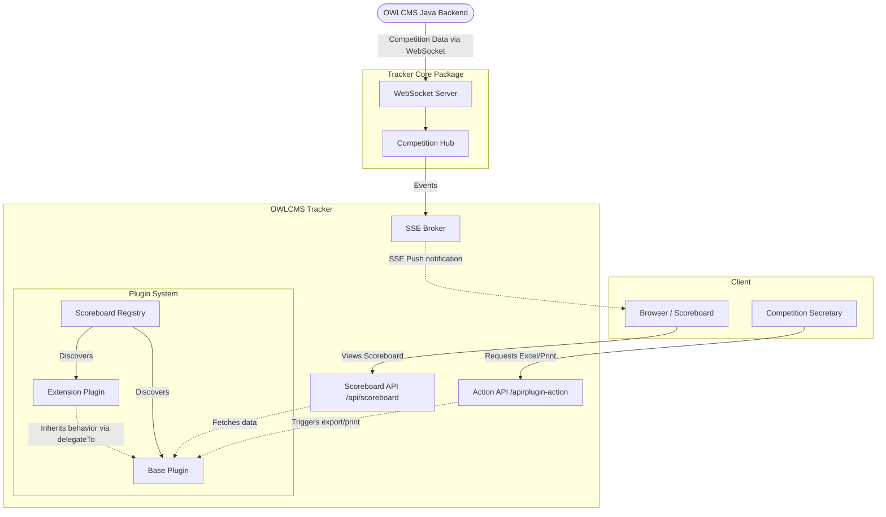

<!-- markdownlint-disable -->
# Scoreboard Architecture - Multi-FOP, Multi-Scoreboard System

## System Architecture Overview


```mermaid
graph TD
    OWLCMS([OWLCMS Java Backend])

    subgraph Client[Client]
        Browser[Browser / Scoreboard]
        Admin[Competition Secretary]
    end

    subgraph Core[Tracker Core Package]
        WSS[WebSocket Server]
        Hub[Competition Hub]
    end

    subgraph Tracker[OWLCMS Tracker]
        Broker[SSE Broker]
        subgraph PluginSystem[Plugin System]
            Registry[Scoreboard Registry]
            BasePlugin[Base Plugin]
            Extension[Extension Plugin]
        end
        ActionAPI[Action API /api/plugin-action]
        ScoreboardAPI[Scoreboard API /api/scoreboard]
    end

    OWLCMS -- Competition Data via WebSocket --> WSS
    WSS --> Hub
    Hub -- Events --> Broker
    
    Extension -. Inherits behavior via delegateTo .-> BasePlugin
    Registry -- Discovers --> BasePlugin
    Registry -- Discovers --> Extension
    
    ScoreboardAPI -. Fetches data .-> BasePlugin
    ActionAPI -. Triggers export/print .-> BasePlugin
    
    Browser -- Views Scoreboard --> ScoreboardAPI
    Admin -- Requests Excel/Print --> ActionAPI
    Broker -. SSE Push notification .-> Browser
```

## Overview

This system targets **15+ different scoreboard types** with **up to 6 simultaneous FOPs**. It supports both **Live Scoreboards** (real-time displays) and **Documents** (Start Books, Results, Excel Exports).

**OWLCMS Integration:**
- OWLCMS sends data via WebSocket connection to `ws://localhost:8096/ws`
- **No changes needed to OWLCMS** - just configure the WebSocket URL once
- Competition Hub stores per-FOP data from WebSocket messages
- Scoreboards pull processed data via `/api/scoreboard?type=...&fop=...`

**Key Design Principles:**
1. **Modular** - Each scoreboard type is self-contained in its folder
2. **Extensible** - Create custom variants (e.g., "France Team Scoreboard") that inherit from a base plugin (currently `teams/team-scoreboard` is the only extension-capable base in this repository). Other plugins may support delegation in future if they export `createHelpers()`.
3. **Server-side processing** - Process data once, serve hundreds of browsers
4. **Action-Oriented** - Support for generating files (Excel, PDF) via `handleAction()`
5. **URL-based configuration** - FOP selection and options via query parameters
6. **No OWLCMS changes required** - Works with existing data flow

## Data Source Priority

**Key principle:** Always use session athletes data first (from WebSocket type="update", stored in the `groupAthletes` key). Only access Database Athletes (from WebSocket type="database") for athletes NOT in the current session (e.g., athletes from previous sessions, different teams).

## Architecture

### High-Level Data Flow with Caching

```
Tracker Core (Competition Hub)
      → Emits 'update' event (lifting order changes, athlete switches)
         ↓
    SSE Broker (owlcms-tracker)
         ↓
         ↓ Broadcasts SSE on state changes
         ↓
Browser 1: Receives SSE → Fetches /api/scoreboard?type=team-scoreboard&fop=A
           ↓
    Plugin helpers.data.js (cache miss)
           ↓ Compute team grouping, sorting, filtering (50ms)
           ↓ Store in plugin cache
           ↓
    Return processed data to Browser 1
    
Browser 2-200: Receive same SSE → Fetch same /api/scoreboard URL
           ↓
    Plugin helpers.data.js (cache hit!)
           ↓ Return cached data (1ms each)
           ↓
    Return processed data to Browsers 2-200

Timer Event: Tracker Core emits 'timer' event (StartTime)
           ↓
    SSE Broker broadcasts SSE
           ↓
    All browsers fetch /api/scoreboard
           ↓
    Plugin cache HIT (data hash unchanged)
           ↓ Return cached data + updated timer state
           ↓
    Browsers update timer display only (no recomputation)
```

**Benefits:**
- ✅ **Performance improvement** - Cache eliminates redundant processing
- ✅ **Timer efficiency** - Timer events don't trigger recomputation
- ✅ **Plugin-specific rules** - Each scoreboard implements custom caching
- ✅ **Scalable to hundreds of browsers** - First browser computes, rest hit cache

### Competition Hub State Stores

The **Competition Hub** (part of `tracker-core`) maintains the state of the competition. For details on how it stores `databaseState` and `fopUpdates`, see **[CORE_ARCHITECTURE.md](../../../tracker-core/docs/CORE_ARCHITECTURE.md)**.

### Update Event Flow (Standard Path)

1. **Tracker Core emits 'update' event**
   - The `Competition Hub` receives a message from OWLCMS, updates its state, and emits an event.
   - The `SSE Broker` in `owlcms-tracker` listens for this event.

2. **SSE Broker broadcasts message**
   - Simple notification: "FOP Platform_A has new data"
   - No payload - just a trigger

3. **All connected browsers receive SSE**
   - Triggers API fetch: `/api/scoreboard?type=lifting-order&fop=Platform_A`
   - Receives complete processed data for display

4. **Scoreboard updates immediately**
   - New lifting order rendered
   - Current athlete highlighted
   - Attempt numbers updated

**Benefits:**
- ✅ **OWLCMS does all business logic** (rankings, sinclair, totals)
- ✅ **Hub processes once** → Hundreds of browsers fetch same result
- ✅ **SSE is lightweight** → Only triggers, no large payloads
- ✅ **Browsers always get fresh data** → No stale cache issues

### Timer Event Flow (Efficient Caching)

Timer events are **optimized for cache efficiency** because they don't change athlete data.

1. **Tracker Core emits 'timer' event**
   - The `Competition Hub` updates the timer state in `fopUpdates[fopName]`.
   - **Important:** Does NOT change `groupAthletes` or `liftingOrderAthletes`.
   - The `SSE Broker` broadcasts message: "FOP Platform_A has new data".

2. **All connected browsers receive SSE**
   - Triggers API fetch: `/api/scoreboard?type=lifting-order&fop=Platform_A`
   - **First browser:** Checks cache using data hash
     - Data hash based on `groupAthletes` JSON (first 100 chars)
     - Hash is **unchanged** because athletes didn't change
     - **Cache HIT** - Returns cached processed data
     - Updates timer state from current `fopUpdate`
     - Processing time: ~1ms (no recomputation)
   - **Remaining 199 browsers:** Same cache hit
     - All fetch same processed data from cache
     - Total processing: 200 × 1ms = 200ms

3. **Browsers update display**
   - Receive processed data with updated timer state
   - Client-side countdown begins (autonomous)
   - No further server communication for 60 seconds
   - Timer ticks locally using `Date.now() - startTime`

**Cache Behavior:**

```javascript
// Plugin cache key does NOT include timer state
const dataHash = fopUpdate?.groupAthletes?.substring(0, 100) || '';
const cacheKey = `${fopName}-${dataHash}-${gender}-${topN}`;
// Timer state changes → Same cache key → Cache HIT ✅

// Extract timer separately (changes frequently)
function extractTimerState(fopUpdate) {
  return {
    state: fopUpdate?.athleteTimerEventType === 'StartTime' ? 'running' : 'stopped',
    timeRemaining: parseInt(fopUpdate?.athleteMillisRemaining || 0),
    duration: parseInt(fopUpdate?.timeAllowed || 60000)
  };
}

// Return cached data + fresh timer state
return {
  ...cachedProcessedData,  // From cache (team groupings, sorting, etc.)
  timer: extractTimerState(fopUpdate)  // Fresh from current update
};
```

**Performance Impact:**

| Event Type | First Browser | Next 199 Browsers | Cache Behavior |
|------------|---------------|-------------------|----------------|
| **Timer StartTime** | 1ms (cache hit) | 1ms each | No recomputation - athletes unchanged |
| **Athlete lifts** | 50ms (cache miss) | 1ms each | Recomputes once - new `groupAthletes` |
| **Weight change** | 50ms (cache miss) | 1ms each | Recomputes once - new `liftingOrderAthletes` |

**Benefits:**
- ✅ **Zero recomputation on timer events** - Cache stays valid
- ✅ **Scalable to hundreds of browsers** - All hit same cache
- ✅ **Client-side countdown** - No server load during 60-second timer
- ✅ **Fresh timer state** - Extracted separately from cached data
- ✅ **40× faster** than recomputing for every browser

**See also:** [Implementation Details → Timer Event Flow](#timer-event-flow-client-side-countdown) for client-side countdown implementation.

### Decision Event Flow

Decision events follow the **same efficient caching pattern as timer events** because the decision itself doesn't change athlete data immediately.

**Two-Phase Processing:**

**Phase 1: Decision Event (Immediate Display)**

1. **Tracker Core emits 'decision' event**
   - The `Competition Hub` updates the decision state in `fopUpdates[fopName]`.
   - **Important:** Does NOT change `groupAthletes` or `liftingOrderAthletes` yet.
   - The `SSE Broker` broadcasts message: "FOP Platform_A has new data".

2. **All connected browsers receive SSE**
   - Triggers API fetch: `/api/scoreboard?type=lifting-order&fop=Platform_A`
   - **Cache HIT** - Athletes unchanged, returns cached processed data
   - Decision state extracted separately from current `fopUpdate`
   - Processing time: ~1ms per browser (no recomputation)

3. **Browsers display decision immediately**
   - Show decision lights/indicators
   - Visual feedback to audience
   - Athlete data remains unchanged (for now)

**Phase 2: Update Event (Recomputed Rankings)**

4. **OWLCMS recomputes** lifting order and rankings based on decision
   - Generates new `groupAthletes` with updated totals
   - Generates new `liftingOrderAthletes` with new order
   - Sends type="update" message (follows Standard Path)

5. **Tracker Core emits 'update' event**
   - New `groupAthletes` JSON → New data hash
   - **Cache MISS** - Data changed, must recompute

6. **Browsers fetch updated data**
   - First browser computes new team groupings, sorting (50ms)
   - Remaining browsers hit fresh cache (1ms each)
   - Display updated lifting order, totals, ranks

**Cache Behavior:**

```javascript
// Decision state extracted separately (like timer)
function extractDecisionState(fopUpdate) {
  return {
    type: fopUpdate?.decisionEventType || null,
    timestamp: fopUpdate?.decisionTimestamp || null,
    refereeDecisions: fopUpdate?.refereeDecisions || [],
    display: fopUpdate?.decisionEventType ? 'show' : 'hide'
  };
}

// Phase 1: Decision event → Cache HIT
const dataHash = fopUpdate?.groupAthletes?.substring(0, 100) || '';
const cacheKey = `${fopName}-${dataHash}-${options}`;
// Decision state changes, athletes unchanged → Same hash → Cache HIT ✅

return {
  ...cachedProcessedData,  // From cache (unchanged athletes)
  decision: extractDecisionState(fopUpdate),  // Fresh decision
  timer: extractTimerState(fopUpdate)  // Fresh timer
};

// Phase 2: Update event → Cache MISS
// New groupAthletes → New hash → Cache MISS → Recompute ✅
```

**Timeline Example:**

```
T=0s:   OWLCMS sends DECISION (GOOD_LIFT)
        → Hub broadcasts SSE
        → 200 browsers fetch /api/scoreboard
        → All hit cache (1ms each, 200ms total)
        → Display decision lights immediately

T=1s:   OWLCMS recomputes rankings
        → Sends UPDATE with new groupAthletes
        → Hub broadcasts SSE
        → First browser recomputes (50ms)
        → Remaining 199 browsers hit fresh cache (199ms)
        → Display updated lifting order, totals
```

**Benefits:**
- ✅ **Instant decision feedback** - Cache hit for immediate display
- ✅ **Deferred ranking update** - Only recomputtes when OWLCMS sends new data
- ✅ **Two-phase processing** - Visual feedback first, data update second
- ✅ **Scalable** - Same cache efficiency as timer events
- ✅ **No redundant computation** - Decision doesn't trigger unnecessary work

**Implementation Status:** 🚧 Not yet implemented - design documented for future development.

## Extensions & Inheritance

The system supports a powerful **extension mechanism** that allows creating custom scoreboards without duplicating code.

### The `delegateTo` Pattern

An extension plugin can inherit all logic from a base plugin by using the `delegateTo` property in its `config.js`.

> Note: in this repository **only** `teams/team-scoreboard` currently functions as a delegated base (see examples below). A plugin can act as a delegation target only if it exports the factory-style helpers (e.g. `createHelpers`).

**Example: Custom Team Scoreboard**
```javascript
// src/plugins/extensions/france-teams/config.js
export default {
    name: 'France Team Scoreboard',
    description: 'Standard team scoreboard with French formatting',
    delegateTo: 'teams/team-scoreboard', // Inherit from base plugin
    
    // Override specific options or add new ones
    options: [
        { key: 'showRegion', default: true }
    ]
};
```

**What is inherited?**
- **Data Processing:** The extension uses `helpers.data.js` from the base plugin.
- **Display Component:** It uses `page.svelte` from the base plugin (unless overridden).
- **Actions:** It inherits `handleAction` for exports/printing.
- **Custom Scoring:** Extensions can inject custom scoring logic (e.g., specific team point formulas) into the base helper.

### Custom Scoring Injection

Base plugins (like `team-scoreboard`) export a factory function `createHelpers(customScoreFn)` instead of a static object. This allows extensions to inject their own logic.

```javascript
// Base Plugin (helpers.data.js)
export function createHelpers(customCalculateScore = null) {
    function getScoreboardData(...) {
        // ... uses customCalculateScore if provided ...
    }
    return { getScoreboardData, handleAction };
}
```

```javascript
// Extension Plugin (runtime injection)
// The registry automatically handles the wiring when delegateTo is used
```

## Actions & Document Generation

Beyond live displays, plugins can perform **Actions** such as generating Excel files, printing specific formats, or producing PDFs.

### Action API Flow

1. **User Request:**
   User clicks "Export Excel" in the scoreboard UI.
   Browser sends POST to `/api/plugin-action`.

2. **Dispatcher:**
   The API identifies the target plugin based on the `plugin` parameter.
   It calls the plugin's `handleAction(action, fop, data, params)` function.

3. **Processing:**
   The `handleAction` function (usually in the base plugin) processes the request (e.g., generates an Excel buffer).

4. **Response:**
   The server returns the file download or action result.

**Example: Excel Export**
```javascript
// src/plugins/teams/team-scoreboard/helpers.data.js
export async function handleAction(action, fop, data, params) {
    if (action === 'export-excel') {
        const workbook = await generateExcel(data);
        return {
            success: true,
            binary: true,
            filename: 'teams.xlsx',
            contentType: 'application/vnd.openxmlformats...',
            buffer: await workbook.xlsx.writeBuffer()
        };
    }
}
```

### Cache Management & Manual Refresh

**Cache Registry Pattern**

All plugin caches register themselves at module load time to enable coordinated cache invalidation:

```javascript
// src/lib/server/cache-epoch.js
let cacheEpoch = 0;
const registeredCaches = new Set();

export function registerCache(cacheMap) {
  registeredCaches.add(cacheMap);
}

export function bumpCacheEpoch() {
  cacheEpoch += 1;
  for (const cache of registeredCaches) {
    cache.clear();  // Clear all registered caches
  }
  return cacheEpoch;
}
```

**Plugin Cache Registration**

Each plugin registers its cache on module load:

```javascript
// src/plugins/team-scoreboard/helpers.data.js
import { registerCache } from '$lib/server/cache-utils.js';

const teamScoreboardCache = new Map();
registerCache(teamScoreboardCache);  // Auto-cleared on refresh
```

**Registered Caches (8 total):**
1. `standard-scoreboard-helpers.js` → `scoreboardCache` (shared by lifting-order, rankings, session-results)
2. `team-scoreboard/helpers.data.js` → `teamScoreboardCache`
3. `attempt-bar/helpers.data.js` → `attemptBarCache`
4. `lower-third/helpers.data.js` → `lowerThirdCache`
5. `ranking-box/helpers.data.js` → `rankingBoxCache`
6. `referee-assignments/helpers.data.js` → `refereeAssignmentsCache`
7. `iwf-startbook/helpers.data.js` → `protocolCache`
8. `iwf-results/helpers.data.js` → `protocolCache`

**Manual Refresh Endpoint**

Developers can manually flush all caches via REST API:

```bash
# Flush plugin caches only (keeps hub data)
curl -X POST http://localhost:8096/api/refresh

# Full refresh: close WebSocket, force OWLCMS to reconnect and resend all data
curl -X POST http://localhost:8096/api/refresh?fullRefresh=true
```

**Refresh Flow:**

1. **POST `/api/refresh`** → `scoreboardRegistry.flushCaches()`
2. **Bump epoch** → Clear all registered caches (prevents memory leaks)
3. **Emit SSE events** → Notify all connected browsers for each FOP
4. **Browsers receive SSE** → Re-fetch scoreboard data via `/api/scoreboard`
5. **First browser** → Cache miss, recomputes from hub data (50ms)
6. **Remaining browsers** → Cache hit, instant response (1ms each)

**Response Example:**

```json
{
  "success": true,
  "message": "Plugin caches flushed - browsers notified to re-fetch",
  "fullRefresh": false,
  "connectionClosed": false,
  "cacheEpoch": 42,
  "browsersNotified": 4,
  "timestamp": 1735862400000
}
```

**Benefits:**
- ✅ **No memory leaks** - Caches are cleared directly, no orphaned entries
- ✅ **Automatic browser updates** - SSE triggers immediate re-fetch
- ✅ **Development workflow** - Test plugin changes without restarting server
- ✅ **Coordinated invalidation** - All plugins cleared atomically
- ✅ **Observable** - Response includes epoch and notification count

---

## Directory Structure

```
extensions/                 # User-created extensions (Runtime discovery)
├── my-custom-board/
│   ├── config.js           # delegateTo: 'teams/team-scoreboard'
│   └── (optional override files)

# Note: extensions are typically small config-only plugins that delegate to `teams/team-scoreboard` in this repo.
src/
├── lib/server/
│   ├── competition-hub.js          # Stores per-FOP data from OWLCMS
│   ├── scoreboard-registry.js      # Auto-discovers scoreboard plugins
│   ├── cache-epoch.js              # Global cache epoch and registry
│   └── cache-utils.js              # Shim for buildCacheKey + registerCache
├── routes/
│   ├── [scoreboard]/
│   │   ├── +page.server.js         # Dynamic route handler
│   │   └── +page.svelte            # Generic scoreboard wrapper
│   └── api/
│       ├── scoreboard/+server.js   # Unified API endpoint
│       └── refresh/+server.js      # Manual cache flush endpoint
└── plugins/
    ├── lifting-order/   # Scoreboard type (display-only)
    │   ├── config.js               # Metadata, options
    │   ├── helpers.data.js         # Server-side data processing
    │   ├── page.svelte             # Display component
    │   └── README.md               # AI prompts
    ├── team-scoreboard/  # Base plugin (extension-capable)
    │   ├── config.js               # Metadata, options (supports delegateTo)
    │   ├── helpers.data.js         # Server-side data processing (exports createHelpers)
    │   ├── page.svelte             # Display component
    │   └── README.md               # AI prompts
    ├── extensions/      # Bundled Extensions
    │   └── france-teams/
    │       ├── config.js           # delegateTo: 'teams/team-scoreboard'
    │       └── helpers.data.js     # (optional) custom scoring logic
    ├── results/         # Scoreboard type 2
    │   └── ...
    └── team-rankings/   # Scoreboard type 3
        └── ...
```

---

## Packaging & Deployment

The tracker supports two packaging formats: **Release** (public distribution) and **Zip** (custom builds with optional plugins).

### Release Package (`npm run release`)

**Purpose:** Production-ready distribution for general users.

**What's included:**
- ✅ All core bundled plugins from `src/plugins/` (compiled into build)
- ✅ Empty `extensions/` directory with README.md (for user-added plugins)
- ✅ Production dependencies only

**What's excluded:**
- ❌ Git submodules (`src/plugins/books`, `extensions/France`, `src/plugins/OBS`)
- ❌ Experimental plugins (`src/plugins/experiments`)
- ❌ Development dependencies

**Command:**
```bash
npm run release -- 2.9.0
```

**GitHub Actions workflow:**
- Checks out code **without submodules** (`submodules: false`)
- Runs `build-zip.js` with `--standard`
- Creates Docker image
- Publishes GitHub release with ZIP file

**Why exclude submodules?**
- Submodules may contain proprietary/federation-specific code (e.g., France scoring)
- IWF protocol books may have licensing restrictions
- Keeps release package minimal and universally applicable

### Zip Package (`npm run zip`)

**Purpose:** Custom builds for specific use cases (testing, specialized deployments).

**Command form:**

```bash
npm run zip -- <tracker-version> [tracker-core-version] [selectors]
```

The first `--` is the npm argument separator. It is required when passing the version or selector options through to the zip script.

The tracker version becomes the output ZIP filename, with timestamp metadata added automatically, for example:

```bash
npm run zip -- 2.18.0 --include-category documents
# creates dist/owlcms-tracker_2.18.0+2026-05-12.14h37.zip
```

Selectors do not add package-name metadata automatically. Use `--name` when the control panel install should keep a custom package name before the timestamp:

```bash
npm run zip -- 2.18.0 --name documents --include-category documents
# creates dist/owlcms-tracker_2.18.0+documents.2026-05-12.14h37.zip
```

**Flexible inclusion via explicit initialization:**

```bash
# Standard build (no submodules)
npm run zip -- 2.9.0

# With IWF books plugin
npm run init books
npm run zip -- 2.9.0 --standard --submodule books
npm run deinit books

# With France extension + books
npm run init France
npm run init books
npm run zip -- 2.9.0 --standard --submodule books --submodule France
npm run deinit France
npm run deinit books
```

**Available submodules (from `.gitmodules`):**
1. `books` → `src/plugins/books` (IWF Start Book, Results Book)
2. `France` → `extensions/France` (French federation team scoreboard)
3. `OBS` → `src/plugins/OBS` (OBS automation)

**Submodule management:**
- `npm run init <name>` - Clone and track submodule at specified branch
- `npm run deinit <name>` - Remove working files but preserve README/LICENSE

**Flags:**
- `--standard` - Include only the built-in plugins present in the default checkout
- `--name <metadata>` - Add package metadata before the automatic timestamp in the ZIP filename version for control-panel installs
- `--include <list>` - Include only plugin or extension display names
- `--include-categories <list>` - Include plugin or extension categories from each `config.js`
- `--submodule <list>` - Include whole submodules such as `books`, `OBS`, or `France`

**Examples:**
```bash
# Public release equivalent (no submodules, no extensions)
npm run zip -- 2.9.0 --standard

# Standard plugins plus all configured documents and remote-control plugins
npm run zip -- 2.9.0 --standard --include-categories documents,remote-control

# Books-enabled build
npm run init books
npm run zip -- 2.9.0 --name books --submodule books
npm run deinit books

# Internal testing with France extension
npm run init France
npm run zip -- 2.9.0 --include "France - Équipes"
npm run deinit France
```

**Key Difference:**
- **Release**: Never includes submodules (controlled by GitHub Actions)
- **Zip**: Developer manually controls what's included via init/deinit

Selectors are additive. `--standard` adds the default-checkout built-ins, `--submodule` adds whole submodules, and `--include` / `--include-categories` add specific plugins or category matches. Category selectors expand to every plugin or extension whose `config.js` declares that category. If a match lives inside a plugin submodule or delegated extension, the required backing content is pulled in automatically. Extensions are never included implicitly just because they exist in the working tree.

Any build that adds selectors beyond plain `--standard` writes a package-root `.custom-build` marker so the OWLCMS control panel can warn before replacing a customized tracker install.

---

## Plugin Structure & Principles

Each scoreboard plugin is a self-contained unit in `src/plugins/<plugin-name>/` consisting of three key files. (Only some plugins are extension-capable — currently `teams/team-scoreboard`.)

### 1. `config.js` (Metadata)
Defines the plugin's identity and configurable options.
- **Purpose:** Used by the registry to discover plugins and validate URL parameters.
- **Content:** Name, description, and an array of option definitions (type, default value, label).

### 2. `helpers.data.js` (Business Logic & Data)
The **only** place where data processing occurs.
- **Principle:** Fetches data from `tracker-core`, processes it, and caches the result.
- **Responsibilities:**
  - Import `competitionHub` from `@owlcms/tracker-core`.
  - Fetch raw data: 
    - `competitionHub.getFopUpdate(fop)` for basic session state.
    - `competitionHub.getDatabaseState()` for full competition data (athletes, teams, records).
    - `competitionHub.getSessionAthletes(fop)` for flattened session athlete list.
  - **Translation:** All translation keys must be resolved here using `competitionHub.getTranslations()`. The Svelte component receives already-translated strings.
  - **Caching:** Must implement a local cache (Map) keyed by FOP version and options to avoid recomputing on every request. **Register the cache** using `registerCache()` from `$lib/server/cache-utils.js` so it gets cleared on manual refresh.
  - **Transformation:** Sorts, filters, and formats data for display.

**Example cache registration:**

```javascript
import { buildCacheKey, registerCache } from '$lib/server/cache-utils.js';

const myPluginCache = new Map();
registerCache(myPluginCache);  // Auto-cleared on /api/refresh
```

### 3. `page.svelte` (Presentation)
A "dumb" view component that renders the data provided by the helper.
- **Principle:** Pure presentation only. No logic, no calculations.
- **Responsibilities:**
  - Receive `data` prop.
  - Render HTML/CSS based on the pre-computed data.
  - Handle client-side timer countdowns (visual only).
  - **No Translations:** Should not perform translation lookups; display provided strings directly.

---

## API Endpoints

The tracker exposes several REST and streaming endpoints for different purposes.

### Browser-Consumed Endpoints

#### `/api/scoreboard` (GET)
**Purpose:** Primary data endpoint for all scoreboard types

**Parameters:**
- `type` (string, required) - Scoreboard type (e.g., `lifting-order`, `team-scoreboard`, `results`)
- `fop` (string, required*) - FOP name (e.g., `Platform_A`, `A`, `B`)
  - *Not required for global scoreboards like `iwf-startbook` or `referee-assignments`
- Additional parameters vary by scoreboard (e.g., `showRecords=true`, `gender=F`, `topN=10`)

**Example:**
```bash
GET /api/scoreboard?type=lifting-order&fop=Platform_A&showRecords=true
```

**Response:**
```json
{
  "success": true,
  "type": "lifting-order",
  "fop": "Platform_A",
  "options": { "showRecords": true },
  "data": {
    "competition": { "name": "2025 Nationals", "fop": "Platform_A" },
    "athletes": [...],
    "timer": { "state": "running", "timeRemaining": 45000 },
    "decision": { "type": null },
    "records": [...]
  },
  "timestamp": 1735862400000
}
```

**Usage Flow:**
1. Browser loads scoreboard page (`/lifting-order?fop=A`)
2. Browser fetches initial data via `/api/scoreboard?type=lifting-order&fop=A`
3. Browser subscribes to SSE for real-time updates
4. On each SSE event, browser re-fetches `/api/scoreboard` for fresh data

---

#### `/api/client-stream` (GET)
**Purpose:** Server-Sent Events (SSE) endpoint for real-time push notifications

**Parameters:**
- `lang` (string, optional) - Language preference (e.g., `en`, `fr`, `es`). Default: `en`

**Example:**
```bash
GET /api/client-stream?lang=fr
```

**Event Types:**
- `fop_update` - FOP data changed (lifting order, athlete switch, weight change)
- `competition_initialized` - Database loaded from OWLCMS
- `hub_ready` - Hub fully initialized (database + translations)
- `waiting` - No competition data available yet
- `translations` - Translation data for requested language

**Event Format:**
```
data: {"type":"fop_update","fop":"Platform_A","data":{...},"timestamp":1735862400000}

data: {"type":"timer","fop":"Platform_A","timestamp":1735862400000}

data: {"type":"decision","fop":"Platform_A","timestamp":1735862400000}
```

**Browser Usage:**
```javascript
const eventSource = new EventSource('/api/client-stream?lang=en');

eventSource.onmessage = (event) => {
  const data = JSON.parse(event.data);
  
  if (data.type === 'fop_update' && data.fop === currentFop) {
    // Re-fetch scoreboard data
    fetch(`/api/scoreboard?type=lifting-order&fop=${currentFop}`)
      .then(res => res.json())
      .then(result => updateDisplay(result.data));
  }
};
```

---

### Development & Admin Endpoints

#### `/api/refresh` (POST)
**Purpose:** Manually flush plugin caches and notify browsers to re-fetch

**Parameters:**
- `fullRefresh=true` (optional) - Close WebSocket to force OWLCMS reconnection

**Examples:**
```bash
# Flush plugin caches only (keeps hub data)
curl -X POST http://localhost:8096/api/refresh

# Full refresh: close WebSocket, force OWLCMS to reconnect
curl -X POST http://localhost:8096/api/refresh?fullRefresh=true
```

**Response:**
```json
{
  "success": true,
  "message": "Plugin caches flushed - browsers notified to re-fetch",
  "fullRefresh": false,
  "connectionClosed": false,
  "cacheEpoch": 42,
  "browsersNotified": 4,
  "timestamp": 1735862400000
}
```

**Workflow:**
1. Clears all registered plugin caches (8 caches total)
2. Emits SSE events for all FOPs (triggers browser re-fetch)
3. Optionally closes WebSocket (if `fullRefresh=true`)

**Use Cases:**
- Testing plugin changes without server restart
- Forcing fresh data fetch during development
- Debugging cache-related issues

---

#### `/api/health` (GET)
**Purpose:** Health check endpoint for monitoring and orchestration

**Response:**
```json
{
  "status": "healthy",
  "timestamp": "2026-01-03T14:30:00.000Z",
  "uptime": 3600,
  "memory": {
    "heapUsedMB": 150,
    "heapTotalMB": 200,
    "rssMB": 300,
    "heapUsagePercent": 75
  },
  "competition": {
    "databaseLoaded": true,
    "athleteCount": 50,
    "fopCount": 3,
    "localeCount": 26
  },
  "metrics": {
    "messagesReceived": 1234,
    "messagesBroadcast": 2468
  }
}
```

**Status Values:**
- `healthy` - All systems operational
- `degraded` - Partial functionality (high memory, missing data)
- `unhealthy` - Critical failure

---

#### `/api/status` (GET)
**Purpose:** Simple readiness check (lighter than `/api/health`)

**Response:**
```json
{
  "status": "ready",
  "message": "Competition Hub is ready to receive OWLCMS messages",
  "ready": true,
  "hasCompetitionData": true,
  "metrics": {
    "activeClients": 12,
    "messagesReceived": 1234,
    "messagesBroadcast": 2468
  },
  "timestamp": "2026-01-03T14:30:00.000Z"
}
```

---

### Endpoint Summary

| Endpoint | Method | Purpose | Used By |
|----------|--------|---------|---------|
| `/api/scoreboard` | GET | Fetch processed scoreboard data | Browsers (on load + SSE trigger) |
| `/api/client-stream` | GET | Real-time SSE push notifications | Browsers (persistent connection) |
| `/api/refresh` | POST | Flush caches + notify browsers | Developers, CI/CD |
| `/api/health` | GET | Detailed health metrics | Monitoring systems |
| `/api/status` | GET | Simple readiness check | Healthcheck probes |

---

# Appendix: Packaging & Release (detailed)

This appendix contains the full, actionable packaging instructions that were previously embedded earlier in the document. Keep these steps when you need to produce a ZIP with federation-specific plugins or to understand what the public release contains.

## Quick summary
- Release (`npm run release`) — public distribution. **Never** includes submodules or runtime `extensions/`; built with `--standard` in CI.
- Zip (`npm run zip`) — custom package for testing or internal builds. Developer controls inclusion of submodules/extensions via `npm run init` / `npm run deinit`.

## Release (public) — mechanics
- Command: `npm run release -- <version>`
- Scripts involved: `scripts/release.js` → triggers GitHub Actions `release.yaml`.
- CI behavior:
  - Checkout does **not** fetch submodules by default (workflow input `includeSubmodules=false`).
  - Build uses `build-zip.js` with `--standard` to include only default-checkout built-ins.
  - Result: a minimal, redistributable ZIP and Docker images.

**Why:** submodules may contain federation-specific or licensed content that cannot be bundled into the public release.

## Zip (developer/custom) — mechanics
- Command: `npm run zip -- <version> [--name <metadata>] [--standard] [--include ...] [--include-category(ies) ...] [--submodule(s) ...]`
- The first `--` is required by npm. It separates `npm run zip` from the arguments passed to `scripts/build-zip.js`.
- The first positional argument is the tracker version and is used in the ZIP filename with automatic timestamp metadata: `npm run zip -- 2.18.0 --include-category documents` creates `dist/owlcms-tracker_2.18.0+2026-05-12.14h37.zip`.
- `--name <metadata>` adds install-preserved package metadata before the timestamp: `npm run zip -- 2.18.0 --name documents --include-category documents` creates `dist/owlcms-tracker_2.18.0+documents.2026-05-12.14h37.zip`, which the control panel installs as `2.18.0+documents.2026-05-12.14h37`.
- The optional second positional argument pins the tracker-core version: `npm run zip -- 2.18.0 1.5.5 --include-category documents`.
- The selectors are additive. Use `--standard` when you want the built-in plugins from the default checkout, then add extras explicitly.
- To include submodule content you must initialize it explicitly:
  - `npm run init books` — pulls `src/plugins/books` submodule
  - `npm run init France` — pulls `extensions/France` submodule
  - After the build, restore repo state with `npm run deinit <name>`

**Notes:**
- `--standard` does not include extensions or initialized submodules by itself.
- Extensions are copied only when explicitly selected by `--include`, `--include-categories`, or `--submodule`.

## Submodules & files of interest
- `.gitmodules` contains: `src/plugins/books`, `extensions/France`, `src/plugins/OBS`.
- `scripts/init-submodule.js` and `scripts/deinit-submodule.js` — helper scripts to manage submodules locally.

## Examples
- Public release (no submodules):
  - `npm run release -- 2.9.0`
- ZIP including books plugin (developer flow):
  - `npm run init books`
  - `npm run zip -- 2.9.0`
  - `npm run deinit books`
- ZIP including France extension (developer flow):
  - `npm run init France`
  - `npm run zip -- 2.9.0`
  - `npm run deinit France`

## TL;DR
- Use **Release** for public distributions (CI will never include submodules/extensions).
- Use **Zip + init/deinit** when you need federation-specific plugins or to produce a custom testing package.


